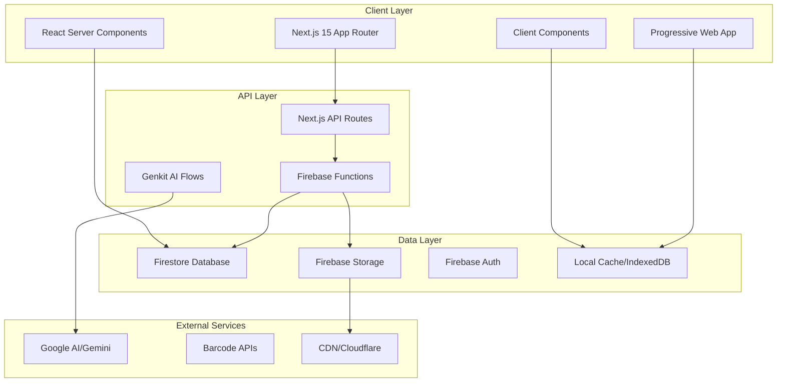
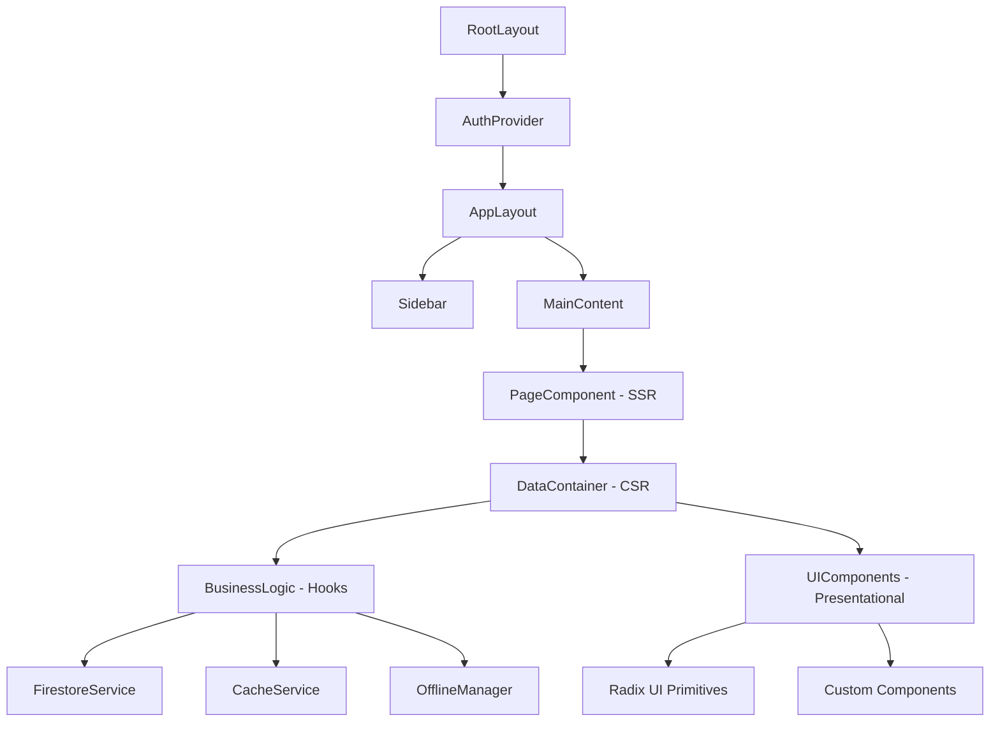
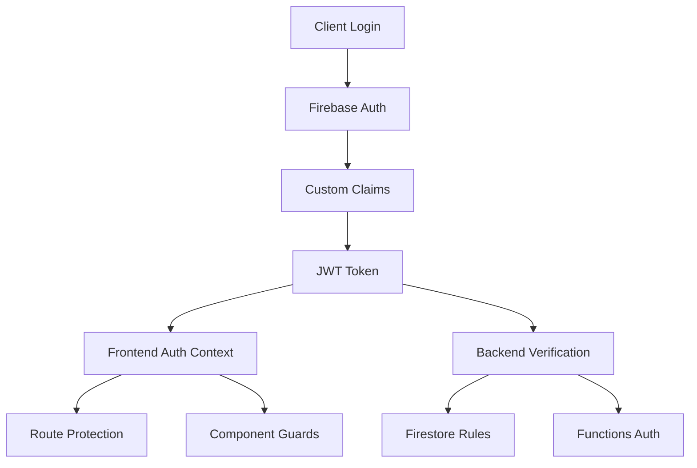

# 🏗️ Architecture Technique - CuisineZen

Cette documentation détaille l'architecture technique de CuisineZen, les patterns utilisés, et les décisions de conception pour assurer scalabilité, maintenabilité et performance.

## 📋 Table des matières

1. [Vue d'ensemble architecturale](#-vue-densemble-architecturale)
2. [Architecture frontend](#-architecture-frontend)
3. [Architecture backend](#-architecture-backend)
4. [Patterns et design principles](#-patterns-et-design-principles)
5. [Gestion d'état](#-gestion-détat)
6. [Sécurité et authentification](#-sécurité-et-authentification)
7. [Performance et optimisations](#-performance-et-optimisations)
8. [Scalabilité](#-scalabilité)
9. [DevOps et déploiement](#-devops-et-déploiement)

---

## 🎯 Vue d'ensemble architecturale

### Philosophie architecturale

CuisineZen adopte une **architecture moderne, modulaire et évolutive** basée sur les principes suivants :

- **Server-First** : Maximisation des Server Components Next.js pour de meilleures performances
- **Firebase-Native** : Exploitation complète de l'écosystème Firebase
- **AI-Enhanced** : Intégration native de l'IA pour automatiser les tâches
- **Offline-Ready** : Fonctionnement robuste hors ligne avec synchronisation
- **Type-Safe** : TypeScript strict pour une robustesse maximale

### Architecture globale



### Stack technologique détaillée

```typescript
// Stack technique par couche
const architectureStack = {
  frontend: {
    framework: "Next.js 15",
    runtime: "React 18",
    rendering: "SSR + SSG + ISR",
    styling: "Tailwind CSS",
    components: "Radix UI",
    icons: "Lucide React",
    forms: "React Hook Form + Zod",
    charts: "Recharts"
  },
  backend: {
    serverless: "Firebase Functions",
    database: "Firestore",
    storage: "Firebase Storage", 
    auth: "Firebase Auth",
    ai: "Google Genkit + Gemini",
    cache: "Firebase Extensions"
  },
  infrastructure: {
    hosting: "Firebase Hosting",
    cdn: "Firebase CDN",
    monitoring: "Firebase Analytics",
    performance: "Firebase Performance",
    crashlytics: "Firebase Crashlytics"
  },
  development: {
    language: "TypeScript",
    bundler: "Turbopack",
    linting: "ESLint",
    formatting: "Prettier",
    testing: "Jest + React Testing Library",
    e2e: "Playwright"
  }
};
```

---

## 🎨 Architecture frontend

### Structuration Next.js App Router

```
src/app/
├── (app)/                 # Groupe d'application authentifiée
│   ├── layout.tsx         # Layout principal avec navigation
│   ├── inventory/         # Module inventaire
│   │   ├── page.tsx      # Page Server Component
│   │   └── loading.tsx   # UI de chargement
│   ├── recipes/          # Module recettes
│   ├── menu/             # Module planification menus
│   ├── shopping-list/    # Module liste de courses
│   └── analytics/        # Module analytics
├── (auth)/               # Groupe d'authentification
│   ├── layout.tsx       # Layout auth simplifié
│   └── login/           # Pages de connexion
└── api/                 # API Routes Next.js
    ├── auth/           # Endpoints d'authentification
    └── webhook/        # Webhooks externes
```

### Hiérarchie des composants



### Séparation Server/Client Components

```tsx
// ✅ Server Component par défaut (SSR/SSG)
// app/inventory/page.tsx
import { getServerProducts } from '@/lib/server-actions';
import { ProductsClient } from './products-client';

export default async function InventoryPage() {
  // Données pré-rendues côté serveur
  const initialProducts = await getServerProducts();
  
  return (
    <div>
      <h1>Inventaire</h1>
      {/* Hydratation avec données initiales */}
      <ProductsClient initialData={initialProducts} />
    </div>
  );
}

// ✅ Client Component pour l'interactivité
// app/inventory/products-client.tsx
'use client';

import { useFirestoreProducts } from '@/hooks/use-firestore';
import { ProductCard } from '@/components/product-card';

export function ProductsClient({ initialData }: { initialData: Product[] }) {
  const { products, loading, addProduct } = useFirestoreProducts({
    initialData,
    realtime: true
  });

  return (
    <div className="grid gap-4">
      {products.map(product => (
        <ProductCard 
          key={product.id} 
          product={product}
          onEdit={handleEdit}
        />
      ))}
    </div>
  );
}
```

### Architecture modulaire par feature

```
src/features/
├── inventory/
│   ├── components/       # Composants spécifiques inventaire
│   ├── hooks/           # Hooks métier inventaire
│   ├── services/        # Services inventaire
│   ├── types/           # Types spécifiques
│   └── index.ts         # Barrel exports
├── recipes/
│   ├── components/
│   ├── hooks/
│   ├── services/
│   └── index.ts
├── menu/
└── analytics/
```

---

## 🔧 Architecture backend

### Firebase Functions Architecture

```typescript
// functions/src/index.ts - Point d'entrée principal
import { initializeApp } from 'firebase-admin/app';
import { onRequest } from 'firebase-functions/v2/https';
import { onDocumentCreated } from 'firebase-functions/v2/firestore';

initializeApp();

// Fonctions HTTP
export const api = onRequest({
  cors: true,
  region: 'europe-west1'
}, require('./api').app);

// Triggers Firestore
export const onProductCreated = onDocumentCreated(
  'restaurants/{restaurantId}/products/{productId}',
  require('./triggers/product-triggers').onProductCreated
);

// Jobs planifiés
export const dailyReports = require('./scheduled/daily-reports').dailyReports;
```

### Structure des Functions

```
functions/src/
├── api/                  # API HTTP endpoints
│   ├── routes/
│   │   ├── products.ts   # CRUD produits
│   │   ├── recipes.ts    # CRUD recettes
│   │   └── analytics.ts  # Analytics et rapports
│   └── middleware/
│       ├── auth.ts       # Middleware d'authentification
│       ├── validation.ts # Validation Zod
│       └── rate-limit.ts # Rate limiting
├── triggers/             # Cloud Functions triggers
│   ├── product-triggers.ts
│   ├── recipe-triggers.ts
│   └── user-triggers.ts
├── scheduled/            # Jobs planifiés
│   ├── daily-reports.ts
│   ├── cleanup.ts
│   └── cost-analysis.ts
├── integrations/         # Intégrations externes
│   ├── pos-webhook.ts    # Point de vente
│   └── inventory-sync.ts # Synchronisation stock
└── utils/               # Utilitaires partagés
    ├── firestore.ts
    ├── storage.ts
    └── notifications.ts
```

### Architecture des données Firestore

```typescript
// Structure optimisée pour un restaurant
interface DatabaseSchema {
  // Collection racine restaurant
  restaurants: {
    [restaurantId: string]: {
      // Métadonnées restaurant
      name: string;
      adminEmails: string[];
      settings: RestaurantSettings;
      
      // Sous-collections par module
      products: { [productId: string]: FirestoreProduct };
      recipes: { [recipeId: string]: FirestoreRecipe };
      menus: { [menuId: string]: WeeklyMenu };
      users: { [userEmail: string]: UserPermissions };
      activities: { [activityId: string]: UserActivity };
      analytics: { [date: string]: DailyAnalytics };
    }
  };
  
  // Collections globales pour optimisation
  globalStats: {
    usage: UsageStatistics;
    costs: CostMetrics;
  };
}
```

### Sécurité Firestore Rules

```javascript
// firestore.rules
rules_version = '2';
service cloud.firestore {
  match /databases/{database}/documents {
    // Règles restaurant
    match /restaurants/{restaurantId} {
      // Accès au restaurant si admin ou utilisateur autorisé
      allow read, write: if isAuthorizedUser(restaurantId);
      
      // Sous-collections avec permissions granulaires
      match /products/{productId} {
        allow read: if isAuthorizedUser(restaurantId);
        allow write: if canWriteProducts(restaurantId);
        allow delete: if isAdmin(restaurantId);
      }
      
      match /recipes/{recipeId} {
        allow read: if isAuthorizedUser(restaurantId);
        allow write: if canWriteRecipes(restaurantId);
        allow delete: if isOwnerOrAdmin(restaurantId, resource);
      }
      
      match /users/{userEmail} {
        allow read: if isAuthorizedUser(restaurantId);
        allow write: if isAdmin(restaurantId);
      }
      
      match /activities/{activityId} {
        allow read: if isAuthorizedUser(restaurantId);
        allow create: if isAuthorizedUser(restaurantId);
      }
    }
  }
  
  // Fonctions helper pour les permissions
  function isAuthorizedUser(restaurantId) {
    return request.auth != null && (
      isAdmin(restaurantId) ||
      exists(/databases/$(database)/documents/restaurants/$(restaurantId)/users/$(request.auth.token.email))
    );
  }
  
  function isAdmin(restaurantId) {
    return request.auth != null && 
      get(/databases/$(database)/documents/restaurants/$(restaurantId)).data.adminEmails.hasAny([request.auth.token.email]);
  }
  
  function canWriteProducts(restaurantId) {
    return isAuthorizedUser(restaurantId) && 
      get(/databases/$(database)/documents/restaurants/$(restaurantId)/users/$(request.auth.token.email)).data.permissions.canCreateProducts == true;
  }
}
```

---

## 🎨 Patterns et design principles

### Design Patterns utilisés

#### 1. Repository Pattern
```typescript
// Abstraction des accès données
interface Repository<T> {
  getAll(): Promise<T[]>;
  getById(id: string): Promise<T | null>;
  create(data: Omit<T, 'id'>): Promise<T>;
  update(id: string, data: Partial<T>): Promise<void>;
  delete(id: string): Promise<void>;
  subscribe(callback: (data: T[]) => void): () => void;
}

// Implémentation Firestore
class FirestoreRepository<T> implements Repository<T> {
  constructor(
    private collectionPath: string,
    private converter: FirestoreDataConverter<T>
  ) {}
  
  async getAll(): Promise<T[]> {
    const snapshot = await getDocs(collection(db, this.collectionPath));
    return snapshot.docs.map(doc => this.converter.fromFirestore(doc));
  }
  
  // ... autres méthodes
}

// Usage
const productRepository = new FirestoreRepository('products', productConverter);
```

#### 2. Factory Pattern pour les services
```typescript
// Factory pour créer des services contextualisés
class ServiceFactory {
  private static instance: ServiceFactory;
  private services: Map<string, any> = new Map();
  
  static getInstance(): ServiceFactory {
    if (!ServiceFactory.instance) {
      ServiceFactory.instance = new ServiceFactory();
    }
    return ServiceFactory.instance;
  }
  
  getProductService(restaurantId: string): ProductService {
    const key = `products-${restaurantId}`;
    if (!this.services.has(key)) {
      this.services.set(key, new ProductService(restaurantId));
    }
    return this.services.get(key);
  }
  
  getRecipeService(restaurantId: string): RecipeService {
    const key = `recipes-${restaurantId}`;
    if (!this.services.has(key)) {
      this.services.set(key, new RecipeService(restaurantId));
    }
    return this.services.get(key);
  }
}

// Usage dans les hooks
export function useProducts(restaurantId: string) {
  const productService = ServiceFactory.getInstance().getProductService(restaurantId);
  // ... logique du hook
}
```

#### 3. Observer Pattern pour la synchronisation temps réel
```typescript
// Gestionnaire d'événements pour la synchronisation
class SyncEventManager {
  private subscribers: Map<string, Set<Function>> = new Map();
  
  subscribe(event: string, callback: Function): () => void {
    if (!this.subscribers.has(event)) {
      this.subscribers.set(event, new Set());
    }
    
    this.subscribers.get(event)!.add(callback);
    
    return () => {
      this.subscribers.get(event)?.delete(callback);
    };
  }
  
  emit(event: string, data: any): void {
    const subscribers = this.subscribers.get(event);
    if (subscribers) {
      subscribers.forEach(callback => callback(data));
    }
  }
}

// Usage pour la synchronisation
export const syncManager = new SyncEventManager();

// Dans le service Firestore
onSnapshot(collection(db, 'products'), (snapshot) => {
  const products = snapshot.docs.map(doc => doc.data());
  syncManager.emit('products:updated', products);
});

// Dans les composants
useEffect(() => {
  return syncManager.subscribe('products:updated', (products) => {
    setProducts(products);
  });
}, []);
```

#### 4. Command Pattern pour les opérations offline
```typescript
// Interface pour les commandes
interface Command {
  id: string;
  type: 'create' | 'update' | 'delete';
  execute(): Promise<void>;
  rollback(): Promise<void>;
  serialize(): string;
}

// Implémentation pour l'ajout de produit
class CreateProductCommand implements Command {
  constructor(
    public id: string,
    private productData: Omit<Product, 'id'>,
    private service: ProductService
  ) {}
  
  async execute(): Promise<void> {
    await this.service.create(this.productData);
  }
  
  async rollback(): Promise<void> {
    await this.service.delete(this.id);
  }
  
  serialize(): string {
    return JSON.stringify({
      type: 'CreateProductCommand',
      id: this.id,
      data: this.productData
    });
  }
}

// Queue de commandes pour mode offline
class CommandQueue {
  private queue: Command[] = [];
  
  add(command: Command): void {
    this.queue.push(command);
    this.persistQueue();
  }
  
  async processAll(): Promise<void> {
    while (this.queue.length > 0) {
      const command = this.queue.shift()!;
      try {
        await command.execute();
      } catch (error) {
        // Rollback et gestion d'erreur
        await command.rollback();
        throw error;
      }
    }
    this.persistQueue();
  }
  
  private persistQueue(): void {
    localStorage.setItem('commandQueue', JSON.stringify(
      this.queue.map(cmd => cmd.serialize())
    ));
  }
}
```

### Principes SOLID appliqués

#### Single Responsibility Principle
```typescript
// ✅ Chaque service a une responsabilité unique
class ProductService {
  // Responsabilité: Gestion CRUD des produits
}

class ImageOptimizationService {
  // Responsabilité: Optimisation des images
}

class CacheService {
  // Responsabilité: Gestion du cache
}
```

#### Open/Closed Principle
```typescript
// ✅ Extension sans modification
abstract class BaseAnalytics {
  abstract generateReport(): Promise<Report>;
}

class InventoryAnalytics extends BaseAnalytics {
  async generateReport(): Promise<InventoryReport> {
    // Implémentation spécifique inventaire
  }
}

class RecipeAnalytics extends BaseAnalytics {
  async generateReport(): Promise<RecipeReport> {
    // Implémentation spécifique recettes
  }
}
```

#### Dependency Inversion Principle
```typescript
// ✅ Dépendance sur les abstractions
interface INotificationService {
  send(message: string, recipient: string): Promise<void>;
}

class EmailNotificationService implements INotificationService {
  async send(message: string, recipient: string): Promise<void> {
    // Implémentation email
  }
}

class ProductService {
  constructor(
    private notificationService: INotificationService
  ) {}
  
  async createProduct(product: Product): Promise<void> {
    // Création produit
    await this.notificationService.send('Produit créé', 'admin@restaurant.com');
  }
}
```

---

## 🗄️ Gestion d'état

### Architecture d'état hybride

```typescript
// État global avec Zustand
interface AppState {
  // État partagé entre modules
  user: User | null;
  restaurant: Restaurant | null;
  preferences: UserPreferences;
  
  // Actions
  setUser: (user: User) => void;
  setRestaurant: (restaurant: Restaurant) => void;
  updatePreferences: (prefs: Partial<UserPreferences>) => void;
}

export const useAppStore = create<AppState>((set) => ({
  user: null,
  restaurant: null,
  preferences: defaultPreferences,
  
  setUser: (user) => set({ user }),
  setRestaurant: (restaurant) => set({ restaurant }),
  updatePreferences: (prefs) => set((state) => ({
    preferences: { ...state.preferences, ...prefs }
  }))
}));
```

### État local optimisé avec SWR pattern

```typescript
// Hook avec cache et revalidation automatique
export function useProducts(restaurantId: string) {
  const { data, error, mutate } = useSWR(
    ['products', restaurantId],
    () => productService.getAll(restaurantId),
    {
      revalidateOnFocus: false,
      revalidateOnReconnect: true,
      dedupingInterval: 60000, // 1 minute
      refreshInterval: 300000, // 5 minutes
    }
  );

  const addProduct = useCallback(async (product: Omit<Product, 'id'>) => {
    // Optimistic update
    const tempProduct = { ...product, id: 'temp-' + Date.now() };
    mutate([...data, tempProduct], false);
    
    try {
      const newProduct = await productService.create(product);
      mutate(); // Revalidation après succès
      return newProduct;
    } catch (error) {
      mutate(); // Rollback en cas d'erreur
      throw error;
    }
  }, [data, mutate]);

  return {
    products: data || [],
    loading: !error && !data,
    error,
    addProduct,
    refresh: () => mutate()
  };
}
```

### Cache multi-niveau

```typescript
// Architecture de cache à plusieurs niveaux
class CacheManager {
  private memoryCache = new Map<string, CacheEntry>();
  private persistentCache: IDBDatabase | null = null;
  
  constructor() {
    this.initIndexedDB();
  }
  
  async get<T>(key: string): Promise<T | null> {
    // Niveau 1: Cache mémoire (plus rapide)
    const memoryEntry = this.memoryCache.get(key);
    if (memoryEntry && !this.isExpired(memoryEntry)) {
      return memoryEntry.data;
    }
    
    // Niveau 2: IndexedDB (persistant)
    const persistentEntry = await this.getFromIndexedDB(key);
    if (persistentEntry && !this.isExpired(persistentEntry)) {
      // Remonte en cache mémoire
      this.memoryCache.set(key, persistentEntry);
      return persistentEntry.data;
    }
    
    return null;
  }
  
  async set<T>(key: string, data: T, ttl: number = 300000): Promise<void> {
    const entry: CacheEntry = {
      data,
      timestamp: Date.now(),
      ttl
    };
    
    // Stockage simultané dans les deux niveaux
    this.memoryCache.set(key, entry);
    await this.setInIndexedDB(key, entry);
  }
  
  private isExpired(entry: CacheEntry): boolean {
    return Date.now() - entry.timestamp > entry.ttl;
  }
}
```

---

## 🔐 Sécurité et authentification

### Architecture d'authentification



### Système de permissions granulaires

```typescript
// Définition des permissions
interface UserPermissions {
  // Permissions produits
  canViewProducts: boolean;
  canCreateProducts: boolean;
  canEditProducts: boolean;
  canDeleteProducts: boolean;
  
  // Permissions recettes
  canViewRecipes: boolean;
  canCreateRecipes: boolean;
  canEditRecipes: boolean;
  canDeleteRecipes: boolean;
  canDeleteOthersRecipes: boolean;
  
  // Permissions menus
  canCreateMenus: boolean;
  canEditMenus: boolean;
  canDeleteMenus: boolean;
  
  // Permissions administration
  canManageUsers: boolean;
  canViewAnalytics: boolean;
  canExportData: boolean;
  canManageSettings: boolean;
}

// Rôles prédéfinis
const ROLE_PERMISSIONS: Record<UserRole, UserPermissions> = {
  admin: {
    canViewProducts: true,
    canCreateProducts: true,
    canEditProducts: true,
    canDeleteProducts: true,
    canViewRecipes: true,
    canCreateRecipes: true,
    canEditRecipes: true,
    canDeleteRecipes: true,
    canDeleteOthersRecipes: true,
    canCreateMenus: true,
    canEditMenus: true,
    canDeleteMenus: true,
    canManageUsers: true,
    canViewAnalytics: true,
    canExportData: true,
    canManageSettings: true
  },
  manager: {
    canViewProducts: true,
    canCreateProducts: true,
    canEditProducts: true,
    canDeleteProducts: false,
    canViewRecipes: true,
    canCreateRecipes: true,
    canEditRecipes: true,
    canDeleteRecipes: true,
    canDeleteOthersRecipes: false,
    canCreateMenus: true,
    canEditMenus: true,
    canDeleteMenus: false,
    canManageUsers: false,
    canViewAnalytics: true,
    canExportData: false,
    canManageSettings: false
  },
  employee: {
    canViewProducts: true,
    canCreateProducts: true,
    canEditProducts: true,
    canDeleteProducts: false,
    canViewRecipes: true,
    canCreateRecipes: false,
    canEditRecipes: false,
    canDeleteRecipes: false,
    canDeleteOthersRecipes: false,
    canCreateMenus: false,
    canEditMenus: false,
    canDeleteMenus: false,
    canManageUsers: false,
    canViewAnalytics: false,
    canExportData: false,
    canManageSettings: false
  }
};
```

### Guards et protection des routes

```tsx
// HOC pour protection des routes
export function withPermission(permission: keyof UserPermissions) {
  return function <T extends {}>(Component: React.ComponentType<T>) {
    return function ProtectedComponent(props: T) {
      const { user, permissions, loading } = useAuth();
      
      if (loading) return <LoadingSpinner />;
      
      if (!user) {
        redirect('/login');
        return null;
      }
      
      if (!permissions[permission]) {
        return <UnauthorizedPage />;
      }
      
      return <Component {...props} />;
    };
  };
}

// Usage
const AdminUserManagement = withPermission('canManageUsers')(UserManagementPage);

// Protection au niveau page
export default function ProductsPage() {
  const { hasPermission } = useAuth();
  
  if (!hasPermission('canViewProducts')) {
    return <UnauthorizedPage />;
  }
  
  return <ProductsPageContent />;
}
```

### Validation et sanitisation

```typescript
// Middleware de validation pour les API routes
export function validateRequest<T>(schema: z.ZodSchema<T>) {
  return (handler: (req: NextRequest, validatedData: T) => Promise<Response>) => {
    return async (req: NextRequest) => {
      try {
        const body = await req.json();
        const validatedData = schema.parse(body);
        return handler(req, validatedData);
      } catch (error) {
        if (error instanceof z.ZodError) {
          return Response.json(
            { error: 'Validation failed', details: error.errors },
            { status: 400 }
          );
        }
        return Response.json(
          { error: 'Invalid request' },
          { status: 400 }
        );
      }
    };
  };
}

// Usage dans API route
const CreateProductSchema = z.object({
  name: z.string().min(1).max(100),
  category: z.enum(['frais', 'surgelé', 'épicerie', 'boisson', 'entretien']),
  batches: z.array(BatchSchema).min(1)
});

export const POST = validateRequest(CreateProductSchema)(
  async (req, validatedData) => {
    // Données déjà validées et typées
    const product = await productService.create(validatedData);
    return Response.json(product);
  }
);
```

---

## ⚡ Performance et optimisations

### Stratégies de chargement

```typescript
// Chargement progressif par priorité
const loadingStrategy = {
  critical: {
    // Données essentielles chargées immédiatement
    components: ['AuthProvider', 'Navigation', 'CoreUI'],
    data: ['user', 'permissions', 'restaurant']
  },
  
  important: {
    // Chargées après le critical path
    components: ['ProductsList', 'RecipesList'],
    data: ['products', 'recipes', 'recentActivities']
  },
  
  deferred: {
    // Chargées en arrière-plan ou à la demande
    components: ['Analytics', 'Reports', 'Settings'],
    data: ['analytics', 'reports', 'fullHistory']
  }
};

// Implémentation avec React Suspense
function App() {
  return (
    <Suspense fallback={<AppLoadingSkeleton />}>
      <CriticalComponents />
      <Suspense fallback={<SectionLoading />}>
        <ImportantComponents />
        <Suspense fallback={null}>
          <DeferredComponents />
        </Suspense>
      </Suspense>
    </Suspense>
  );
}
```

### Code splitting intelligent

```typescript
// Splitting par route avec preload
const InventoryPage = lazy(() => 
  import('./pages/inventory').then(module => ({
    default: module.InventoryPage
  }))
);

const RecipesPage = lazy(() => import('./pages/recipes'));
const MenuPage = lazy(() => import('./pages/menu'));

// Preload intelligent basé sur la navigation
export function useRoutePreload() {
  const router = useRouter();
  
  useEffect(() => {
    const handleRouteChange = (url: string) => {
      // Preload les routes adjacentes
      if (url.includes('/inventory')) {
        import('./pages/recipes'); // Preload recettes
      } else if (url.includes('/recipes')) {
        import('./pages/menu'); // Preload menu
      }
    };
    
    router.events.on('routeChangeStart', handleRouteChange);
    return () => router.events.off('routeChangeStart', handleRouteChange);
  }, [router]);
}
```

### Optimisation des requêtes Firestore

```typescript
// Stratégie de pagination intelligente
class SmartPagination<T> {
  private pageSize: number;
  private cache: Map<number, T[]> = new Map();
  private lastVisible: DocumentSnapshot | null = null;
  
  constructor(
    private collection: string,
    private orderBy: string,
    pageSize: number = 25
  ) {
    this.pageSize = pageSize;
  }
  
  async getPage(pageNumber: number): Promise<T[]> {
    // Vérifier le cache d'abord
    if (this.cache.has(pageNumber)) {
      return this.cache.get(pageNumber)!;
    }
    
    let q = query(
      collection(db, this.collection),
      orderBy(this.orderBy),
      limit(this.pageSize)
    );
    
    // Utiliser startAfter pour les pages suivantes
    if (pageNumber > 0 && this.lastVisible) {
      q = query(q, startAfter(this.lastVisible));
    }
    
    const snapshot = await getDocs(q);
    const data = snapshot.docs.map(doc => ({ id: doc.id, ...doc.data() } as T));
    
    // Mettre en cache et sauver la position
    this.cache.set(pageNumber, data);
    this.lastVisible = snapshot.docs[snapshot.docs.length - 1] || null;
    
    return data;
  }
  
  // Invalidation intelligente du cache
  invalidateFromPage(pageNumber: number): void {
    for (let i = pageNumber; i < this.cache.size; i++) {
      this.cache.delete(i);
    }
    this.lastVisible = null;
  }
}
```

### Optimisation des images

```typescript
// Service d'optimisation d'images multi-format
class ImageOptimizationService {
  async optimizeAndUpload(file: File, path: string): Promise<ImageUrls> {
    const optimizations = await Promise.all([
      this.createWebP(file, { quality: 0.8 }),
      this.createJPEG(file, { quality: 0.85 }),
      this.createThumbnail(file, { size: 150 }),
      this.createThumbnail(file, { size: 300 })
    ]);
    
    const [webp, jpeg, thumb150, thumb300] = optimizations;
    
    // Upload parallèle de tous les formats
    const uploadPromises = [
      this.uploadToStorage(webp, `${path}.webp`),
      this.uploadToStorage(jpeg, `${path}.jpg`),
      this.uploadToStorage(thumb150, `${path}_thumb_150.webp`),
      this.uploadToStorage(thumb300, `${path}_thumb_300.webp`)
    ];
    
    const [webpUrl, jpegUrl, thumb150Url, thumb300Url] = await Promise.all(uploadPromises);
    
    return {
      webp: webpUrl,
      jpeg: jpegUrl,
      thumbnails: {
        small: thumb150Url,
        medium: thumb300Url
      }
    };
  }
  
  private async createWebP(file: File, options: { quality: number }): Promise<Blob> {
    return new Promise((resolve) => {
      const canvas = document.createElement('canvas');
      const ctx = canvas.getContext('2d')!;
      const img = new Image();
      
      img.onload = () => {
        canvas.width = img.width;
        canvas.height = img.height;
        ctx.drawImage(img, 0, 0);
        
        canvas.toBlob(resolve, 'image/webp', options.quality);
      };
      
      img.src = URL.createObjectURL(file);
    });
  }
}
```

---

## 📈 Scalabilité

### Architecture horizontale

```typescript
// Configuration pour scale horizontal
const scalabilityConfig = {
  database: {
    // Partitioning par restaurant
    sharding: 'restaurant-based',
    
    // Collections séparées pour gros volumes
    collections: {
      products: 'restaurants/{id}/products',
      recipes: 'restaurants/{id}/recipes',
      activities: 'activities/{year}/{month}' // Partition par date
    },
    
    // Index pour requêtes optimisées
    indexes: [
      { collection: 'products', fields: ['category', 'createdAt'] },
      { collection: 'recipes', fields: ['createdBy', 'createdAt'] },
      { collection: 'activities', fields: ['restaurantId', 'timestamp'] }
    ]
  },
  
  storage: {
    // CDN pour assets statiques
    cdn: 'firebase-cdn',
    
    // Optimisation des images
    formats: ['webp', 'jpeg'],
    sizes: [150, 300, 600, 1200],
    
    // Compression automatique
    compression: {
      images: { quality: 0.8, format: 'webp' },
      documents: { format: 'gzip' }
    }
  },
  
  functions: {
    // Regions multiples pour latence
    regions: ['europe-west1', 'us-central1'],
    
    // Concurrence et timeouts
    concurrency: 100,
    timeout: '60s',
    memory: '512MB'
  }
};
```

### Cache distribué

```typescript
// Système de cache multi-niveau pour scale
class DistributedCache {
  private localCache = new Map<string, CacheEntry>();
  private redisCache: Redis | null = null;
  private firestoreCache: FirestoreCache;
  
  constructor() {
    this.initializeRedis();
    this.firestoreCache = new FirestoreCache();
  }
  
  async get<T>(key: string): Promise<T | null> {
    // L1: Cache local (mémoire)
    const local = this.localCache.get(key);
    if (local && !this.isExpired(local)) {
      return local.data;
    }
    
    // L2: Redis (partagé entre instances)
    if (this.redisCache) {
      const redis = await this.redisCache.get(key);
      if (redis) {
        const parsed = JSON.parse(redis);
        if (!this.isExpired(parsed)) {
          this.localCache.set(key, parsed);
          return parsed.data;
        }
      }
    }
    
    // L3: Firestore (persistant)
    const firestore = await this.firestoreCache.get(key);
    if (firestore) {
      // Remonter dans les caches supérieurs
      this.localCache.set(key, firestore);
      if (this.redisCache) {
        await this.redisCache.setex(key, 300, JSON.stringify(firestore));
      }
      return firestore.data;
    }
    
    return null;
  }
  
  async set<T>(key: string, data: T, ttl: number = 300): Promise<void> {
    const entry: CacheEntry = {
      data,
      timestamp: Date.now(),
      ttl: ttl * 1000
    };
    
    // Écriture parallèle dans tous les niveaux
    const promises = [
      this.setLocal(key, entry),
      this.firestoreCache.set(key, entry)
    ];
    
    if (this.redisCache) {
      promises.push(
        this.redisCache.setex(key, ttl, JSON.stringify(entry))
      );
    }
    
    await Promise.all(promises);
  }
}
```

### Auto-scaling des ressources

```typescript
// Monitoring et auto-scaling basé sur les métriques
class ResourceScaler {
  private metrics: Map<string, number[]> = new Map();
  
  async monitorAndScale(): Promise<void> {
    const currentMetrics = await this.getCurrentMetrics();
    
    // CPU usage
    if (currentMetrics.cpu > 80) {
      await this.scaleUp('compute');
    } else if (currentMetrics.cpu < 20) {
      await this.scaleDown('compute');
    }
    
    // Database reads
    if (currentMetrics.dbReads > 10000) {
      await this.enableReadReplicas();
    }
    
    // Storage usage
    if (currentMetrics.storage > 80) {
      await this.enableStorageCompression();
    }
  }
  
  private async scaleUp(resource: string): Promise<void> {
    switch (resource) {
      case 'compute':
        // Augmenter les instances Functions
        await this.updateFunctionsConcurrency(150);
        break;
        
      case 'database':
        // Activer le cache supplémentaire
        await this.enableDatabaseCache();
        break;
    }
  }
  
  private async enableReadReplicas(): Promise<void> {
    // Configuration des répliques de lecture
    const regions = ['europe-west1', 'us-central1', 'asia-southeast1'];
    
    for (const region of regions) {
      await this.deployReadReplica(region);
    }
  }
}
```

---

## 🚀 DevOps et déploiement

### Pipeline CI/CD

```yaml
# .github/workflows/deploy.yml
name: Deploy CuisineZen

on:
  push:
    branches: [main, develop]
  pull_request:
    branches: [main]

jobs:
  test:
    runs-on: ubuntu-latest
    steps:
      - uses: actions/checkout@v3
      
      - name: Setup Node.js
        uses: actions/setup-node@v3
        with:
          node-version: 18
          cache: 'npm'
      
      - name: Install dependencies
        run: npm ci
      
      - name: Run tests
        run: |
          npm run test:unit
          npm run test:integration
          npm run test:e2e
      
      - name: Type check
        run: npm run typecheck
      
      - name: Lint
        run: npm run lint
      
      - name: Build
        run: npm run build

  security:
    runs-on: ubuntu-latest
    steps:
      - uses: actions/checkout@v3
      
      - name: Security audit
        run: npm audit --audit-level high
      
      - name: Vulnerability scan
        uses: github/super-linter@v4
        env:
          DEFAULT_BRANCH: main
          GITHUB_TOKEN: ${{ secrets.GITHUB_TOKEN }}

  deploy-staging:
    needs: [test, security]
    if: github.ref == 'refs/heads/develop'
    runs-on: ubuntu-latest
    steps:
      - uses: actions/checkout@v3
      
      - name: Deploy to Firebase Staging
        run: |
          npm install -g firebase-tools
          firebase deploy --project staging --token ${{ secrets.FIREBASE_TOKEN }}

  deploy-production:
    needs: [test, security]
    if: github.ref == 'refs/heads/main'
    runs-on: ubuntu-latest
    steps:
      - uses: actions/checkout@v3
      
      - name: Deploy to Firebase Production
        run: |
          npm install -g firebase-tools
          firebase deploy --project production --token ${{ secrets.FIREBASE_TOKEN }}
      
      - name: Notify deployment
        run: |
          curl -X POST ${{ secrets.SLACK_WEBHOOK }} \
            -H 'Content-type: application/json' \
            --data '{"text":"CuisineZen deployed to production successfully! 🚀"}'
```

### Configuration d'environnements

```typescript
// config/environments.ts
interface EnvironmentConfig {
  firebase: {
    projectId: string;
    region: string;
    functions: {
      timeout: string;
      memory: string;
      concurrency: number;
    };
  };
  features: {
    analytics: boolean;
    debug: boolean;
    offlineMode: boolean;
  };
  limits: {
    maxImageSize: number;
    maxFileUploads: number;
    rateLimitRpm: number;
  };
}

export const environments: Record<string, EnvironmentConfig> = {
  development: {
    firebase: {
      projectId: 'cuisinezen-dev',
      region: 'europe-west1',
      functions: {
        timeout: '60s',
        memory: '256MB',
        concurrency: 10
      }
    },
    features: {
      analytics: false,
      debug: true,
      offlineMode: true
    },
    limits: {
      maxImageSize: 10 * 1024 * 1024, // 10MB
      maxFileUploads: 5,
      rateLimitRpm: 1000
    }
  },
  
  staging: {
    firebase: {
      projectId: 'cuisinezen-staging',
      region: 'europe-west1',
      functions: {
        timeout: '60s',
        memory: '512MB',
        concurrency: 50
      }
    },
    features: {
      analytics: true,
      debug: true,
      offlineMode: true
    },
    limits: {
      maxImageSize: 5 * 1024 * 1024, // 5MB
      maxFileUploads: 10,
      rateLimitRpm: 500
    }
  },
  
  production: {
    firebase: {
      projectId: 'cuisinezen-prod',
      region: 'europe-west1',
      functions: {
        timeout: '60s',
        memory: '1GB',
        concurrency: 100
      }
    },
    features: {
      analytics: true,
      debug: false,
      offlineMode: true
    },
    limits: {
      maxImageSize: 5 * 1024 * 1024, // 5MB
      maxFileUploads: 20,
      rateLimitRpm: 200
    }
  }
};
```

### Monitoring et observabilité

```typescript
// monitoring/performance.ts
class PerformanceMonitor {
  private metrics: Map<string, PerformanceMetric[]> = new Map();
  
  startMeasure(name: string): void {
    performance.mark(`${name}-start`);
  }
  
  endMeasure(name: string): number {
    performance.mark(`${name}-end`);
    performance.measure(name, `${name}-start`, `${name}-end`);
    
    const measure = performance.getEntriesByName(name)[0] as PerformanceMeasure;
    const duration = measure.duration;
    
    this.recordMetric(name, {
      duration,
      timestamp: Date.now(),
      type: 'performance'
    });
    
    // Envoi vers Firebase Analytics
    if (typeof window !== 'undefined' && window.gtag) {
      window.gtag('event', 'timing_complete', {
        name: name,
        value: Math.round(duration)
      });
    }
    
    return duration;
  }
  
  recordMetric(name: string, metric: PerformanceMetric): void {
    if (!this.metrics.has(name)) {
      this.metrics.set(name, []);
    }
    
    const metrics = this.metrics.get(name)!;
    metrics.push(metric);
    
    // Garder seulement les 100 dernières mesures
    if (metrics.length > 100) {
      metrics.shift();
    }
    
    // Alertes si performance dégradée
    this.checkPerformanceThresholds(name, metric);
  }
  
  private checkPerformanceThresholds(name: string, metric: PerformanceMetric): void {
    const thresholds = {
      'page-load': 3000,
      'api-call': 1000,
      'database-query': 500,
      'image-upload': 5000
    };
    
    const threshold = thresholds[name as keyof typeof thresholds];
    if (threshold && metric.duration > threshold) {
      console.warn(`Performance warning: ${name} took ${metric.duration}ms (threshold: ${threshold}ms)`);
      
      // Envoi d'alerte en production
      if (process.env.NODE_ENV === 'production') {
        this.sendPerformanceAlert(name, metric);
      }
    }
  }
}

// Usage dans les composants
export function usePerformanceMonitoring() {
  const monitor = useRef(new PerformanceMonitor());
  
  const measureAsync = useCallback(async <T>(
    name: string,
    operation: () => Promise<T>
  ): Promise<T> => {
    monitor.current.startMeasure(name);
    try {
      const result = await operation();
      return result;
    } finally {
      monitor.current.endMeasure(name);
    }
  }, []);
  
  return { measureAsync };
}
```

---

## 🎯 Conclusion et évolutions futures

### Architecture actuelle vs. cible

| Aspect | État actuel | Cible à 6 mois | Cible à 1 an |
|--------|-------------|----------------|---------------|
| **Scalabilité** | 1 restaurant | 10 restaurants | 100+ restaurants |
| **Performance** | <2s chargement | <1s chargement | <500ms chargement |
| **Offline** | Basique | Complet | Synchronisation avancée |
| **IA** | 2 flows | 10+ flows | IA prédictive |
| **Testing** | 40% | 90% | 95% + E2E |
| **Monitoring** | Basique | Complet | Prédictif |

### Évolutions architecturales prévues

#### Phase 1 (0-3 mois) : Stabilisation
- Migration complète vers l'architecture documentée
- Tests automatisés complets
- Monitoring et alertes
- Performance optimization

#### Phase 2 (3-6 mois) : Scalabilité
- Multi-tenancy (plusieurs restaurants)
- Cache distribué avec Redis
- API publique avec rate limiting
- Microservices pour modules complexes

#### Phase 3 (6-12 mois) : Intelligence
- IA prédictive pour gestion des stocks
- Recommandations automatiques
- Analytics avancées avec ML
- Intégrations externes (POS, fournisseurs)

### Métriques d'architecture

```typescript
// Tableau de bord architectural
const architectureMetrics = {
  codeQuality: {
    maintainabilityIndex: 85, // Objectif: >80
    cyclomaticComplexity: 12, // Objectif: <15
    testCoverage: 90, // Objectif: >85
    techDebt: '2 semaines' // Objectif: <1 mois
  },
  
  performance: {
    bundleSize: '800KB', // Objectif: <1MB
    firstLoad: '1.2s', // Objectif: <1s
    ttfb: '200ms', // Objectif: <300ms
    lighthouse: 95 // Objectif: >90
  },
  
  scalability: {
    maxConcurrentUsers: 1000, // Objectif: 10000
    dbQueriesPerSecond: 100, // Objectif: 1000
    avgResponseTime: '150ms', // Objectif: <200ms
    errorRate: '0.1%' // Objectif: <0.5%
  },
  
  security: {
    vulnerabilities: 0, // Objectif: 0
    securityScore: 'A+', // Objectif: A+
    dataEncryption: '100%', // Objectif: 100%
    accessControl: 'Granular' // Objectif: Granular
  }
};
```

Cette architecture offre une base solide pour l'évolution de CuisineZen tout en maintenant la flexibilité nécessaire pour s'adapter aux besoins futurs.

*Documentation mise à jour le 15 août 2025*