# 🎯 Système DoD - Definition of Done - CuisineZen

**Version** : 2.0  
**Date** : 15 août 2025  
**Maintainer** : Équipe CuisineZen  
**Status** : Production Ready

---

## 📋 Table des matières

1. [Vue d'ensemble du système DoD](#-vue-densemble-du-système-dod)
2. [Guide d'utilisation](#-guide-dutilisation)
3. [Configuration des environnements](#-configuration-des-environnements)
4. [Maintenance et évolution](#-maintenance-et-évolution)
5. [Métriques et reporting](#-métriques-et-reporting)
6. [Troubleshooting](#-troubleshooting)

---

## 🎯 Vue d'ensemble du système DoD

### Philosophie DoD pour CuisineZen

Le système Definition of Done (DoD) de CuisineZen garantit qu'**aucune fonctionnalité n'est considérée comme terminée** tant qu'elle n'a pas passé l'ensemble des gates de qualité définis. Ce système automatisé évalue :

- **Qualité du code** : Tests, couverture, complexité
- **Sécurité** : Vulnérabilités, authentification, permissions
- **Performance** : Temps de chargement, optimisations, métriques
- **Accessibilité** : Standards WCAG, responsive design
- **Documentation** : API docs, guides utilisateur, changelog

### Architecture du système DoD

```mermaid
graph TD
    A[Développeur - Code Push] --> B[Pre-commit Hooks]
    B --> C[GitHub Actions CI]
    C --> D[Tests Unitaires]
    C --> E[Tests d'Intégration]
    C --> F[Tests E2E]
    D --> G[Quality Gates]
    E --> G
    F --> G
    G --> H[Security Scan]
    G --> I[Performance Analysis]
    G --> J[Accessibility Check]
    H --> K[DoD Agent IA]
    I --> K
    J --> K
    K --> L{DoD Status}
    L -->|✅ Pass| M[Deploy Staging]
    L -->|❌ Fail| N[Block & Report]
    M --> O[Production Gates]
    O --> P[Deploy Production]
```



### Gates de qualité obligatoires

| Gate | Description | Seuil Minimum | Impact Échec |
|------|-------------|---------------|--------------|
| **Tests** | Couverture et réussite | 85% coverage, 0 failures | 🔴 Blocage |
| **Sécurité** | Scan vulnérabilités | 0 critical, <3 high | 🔴 Blocage |
| **Performance** | Core Web Vitals | LCP <2.5s, CLS <0.1 | 🟡 Warning |
| **TypeScript** | Compilation sans erreur | 0 errors | 🔴 Blocage |
| **Linting** | Respect des standards | 0 errors, <10 warnings | 🟡 Warning |
| **Build** | Compilation successful | Build success | 🔴 Blocage |

---

## 📖 Guide d'utilisation

### Installation et configuration initiale

#### 1. Setup du système DoD

```bash
# Installation des dépendances DoD
npm install --save-dev \
  jest \
  @testing-library/react \
  @testing-library/jest-dom \
  playwright \
  eslint-plugin-security \
  lighthouse-ci \
  @typescript-eslint/parser

# Configuration des hooks Git
npx husky install
npx husky add .husky/pre-commit "npm run dod:pre-commit"
npx husky add .husky/pre-push "npm run dod:pre-push"
```

#### 2. Configuration package.json

```json
{
  "scripts": {
    "dod:full": "npm run dod:test && npm run dod:security && npm run dod:performance",
    "dod:test": "npm run test:coverage && npm run test:e2e",
    "dod:security": "npm audit --audit-level high && npm run lint:security",
    "dod:performance": "npm run lighthouse && npm run bundle-analyzer",
    "dod:pre-commit": "npm run typecheck && npm run lint && npm run test:changed",
    "dod:pre-push": "npm run dod:full",
    
    "test:coverage": "jest --coverage --coverageThreshold='{\"\global\":{\"branches\":85,\"functions\":85,\"lines\":85,\"statements\":85}}'",
    "test:e2e": "playwright test",
    "test:changed": "jest --findRelatedTests --passWithNoTests",
    
    "lint:security": "eslint . --ext .ts,.tsx --config .eslintrc.security.js",
    "lighthouse": "lhci autorun",
    "bundle-analyzer": "npx webpack-bundle-analyzer .next/static/chunks/*.js"
  }
}
```

### Commandes principales pour exécuter les tests

#### Tests et validation locaux

```bash
# ✅ DoD complet (avant merge request)
npm run dod:full

# 🧪 Tests uniquement
npm run dod:test

# 🔒 Sécurité uniquement
npm run dod:security

# ⚡ Performance uniquement
npm run dod:performance

# 🏃‍♂️ Validation rapide (pre-commit)
npm run dod:pre-commit
```

#### Tests spécialisés par module

```bash
# Tests par feature
npm test -- src/features/inventory
npm test -- src/features/recipes
npm test -- src/features/menu

# Tests par type
npm run test:unit
npm run test:integration
npm run test:e2e

# Tests de performance spécifiques
npm run test:performance:images
npm run test:performance:load
npm run test:performance:lighthouse
```

### Interprétation des résultats

#### ✅ Succès DoD - Exemple de sortie

```bash
✅ DoD Quality Gates - ALL PASSED
╭──────────────────────────────────────────────╮
│                                              │
│  🎯 Definition of Done - CuisineZen v2.0     │
│                                              │
│  ✅ Tests:        Coverage 92% (> 85%)       │
│  ✅ Security:     0 vulnerabilities          │
│  ✅ Performance:  LCP 1.8s (< 2.5s)         │
│  ✅ TypeScript:   0 errors                   │
│  ✅ Linting:      0 errors, 3 warnings       │
│  ✅ Build:        Success                     │
│                                              │
│  🚀 Ready for deployment!                    │
│                                              │
╰──────────────────────────────────────────────╯

Next steps:
→ Deploy to staging: npm run deploy:staging
→ View full report: npm run dod:report
```

#### ❌ Échec DoD - Exemple de sortie

```bash
❌ DoD Quality Gates - FAILED
╭──────────────────────────────────────────────╮
│                                              │
│  🎯 Definition of Done - CuisineZen v2.0     │
│                                              │
│  ❌ Tests:        Coverage 73% (< 85%)       │
│  ✅ Security:     0 vulnerabilities          │
│  ❌ Performance:  LCP 3.2s (> 2.5s)         │
│  ✅ TypeScript:   0 errors                   │
│  ⚠️  Linting:      0 errors, 12 warnings     │
│  ✅ Build:        Success                     │
│                                              │
│  🚫 DEPLOYMENT BLOCKED                       │
│                                              │
╰──────────────────────────────────────────────╯

Issues to fix:
→ Add tests: npm run test:coverage:missing
→ Optimize performance: npm run performance:analyze
→ Fix warnings: npm run lint:fix
```

### Workflow de développement avec DoD

#### 1. Développement local

```bash
# Avant de commencer à coder
npm run dod:pre-commit

# Pendant le développement (TDD)
npm run test:watch

# Avant de commit
git add .
# ← Pre-commit hook exécute automatiquement DoD
git commit -m "feat: nouvelle fonctionnalité"
```

#### 2. Intégration continue

```bash
# Push déclenche automatiquement
git push origin feature/nouvelle-fonctionnalite

# GitHub Actions exécute :
# 1. DoD complet
# 2. Tests multi-environnements
# 3. Déploiement staging si succès
# 4. Notification équipe
```

#### 3. Déploiement production

```bash
# Merge vers main déclenche :
# 1. DoD complet + tests supplémentaires
# 2. Déploiement staging
# 3. Tests smoke staging
# 4. Déploiement production
# 5. Tests smoke production
# 6. Monitoring post-déploiement
```

---

## 🔧 Configuration des environnements

### Setup pour développement local

#### Configuration VSCode recommandée

```json
// .vscode/settings.json
{
  "editor.codeActionsOnSave": {
    "source.fixAll.eslint": true,
    "source.organizeImports": true
  },
  "typescript.preferences.includePackageJsonAutoImports": "auto",
  "jest.autoRun": "watch",
  "jest.showCoverageOnLoad": true,
  "emmet.includeLanguages": {
    "typescript": "typescriptreact"
  },
  "files.associations": {
    "*.dod.js": "javascript"
  }
}
```

#### Extensions VSCode recommandées

```json
// .vscode/extensions.json
{
  "recommendations": [
    "ms-vscode.vscode-typescript-next",
    "esbenp.prettier-vscode",
    "ms-vscode.vscode-eslint",
    "orta.vscode-jest",
    "bradlc.vscode-tailwindcss",
    "ms-playwright.playwright",
    "humao.rest-client"
  ]
}
```

### Configuration CI/CD GitHub Actions

#### Workflow principal `.github/workflows/dod.yml`

```yaml
name: 🎯 DoD Quality Gates

on:
  push:
    branches: [ main, develop ]
  pull_request:
    branches: [ main ]

env:
  NODE_VERSION: 18

jobs:
  dod-validation:
    name: DoD Validation Suite
    runs-on: ubuntu-latest
    timeout-minutes: 30
    
    strategy:
      matrix:
        node-version: [18, 20]
    
    steps:
      - name: 📥 Checkout code
        uses: actions/checkout@v4
        with:
          fetch-depth: 0
      
      - name: 📦 Setup Node.js ${{ matrix.node-version }}
        uses: actions/setup-node@v4
        with:
          node-version: ${{ matrix.node-version }}
          cache: 'npm'
      
      - name: 📦 Install dependencies
        run: |
          npm ci
          cd functions && npm ci
      
      - name: 🔧 Cache dependencies
        uses: actions/cache@v3
        with:
          path: |
            ~/.npm
            .next/cache
          key: ${{ runner.os }}-nextjs-${{ hashFiles('**/package-lock.json') }}-${{ hashFiles('**.[jt]s', '**.[jt]sx') }}
          restore-keys: |
            ${{ runner.os }}-nextjs-${{ hashFiles('**/package-lock.json') }}-
      
      - name: 🏗️ Build application
        run: npm run build
      
      - name: 🔍 TypeScript check
        run: npm run typecheck
      
      - name: 🧪 Run DoD test suite
        run: npm run dod:test
        env:
          CI: true
      
      - name: 🔒 Security audit
        run: npm run dod:security
      
      - name: ⚡ Performance analysis
        run: npm run dod:performance
        env:
          LHCI_GITHUB_APP_TOKEN: ${{ secrets.LHCI_GITHUB_APP_TOKEN }}
      
      - name: 📊 Upload coverage reports
        uses: codecov/codecov-action@v3
        with:
          files: ./coverage/lcov.info
          flags: unittests
          name: codecov-umbrella
      
      - name: 🤖 DoD AI Agent Analysis
        run: npm run dod:ai-analysis
        env:
          OPENAI_API_KEY: ${{ secrets.OPENAI_API_KEY }}
      
      - name: 📈 Generate DoD report
        run: npm run dod:report
      
      - name: 📝 Comment PR with results
        if: github.event_name == 'pull_request'
        uses: actions/github-script@v6
        with:
          script: |
            const fs = require('fs');
            const reportPath = './dod-report.md';
            if (fs.existsSync(reportPath)) {
              const report = fs.readFileSync(reportPath, 'utf8');
              github.rest.issues.createComment({
                issue_number: context.issue.number,
                owner: context.repo.owner,
                repo: context.repo.repo,
                body: report
              });
            }

  deploy-staging:
    name: Deploy to Staging
    needs: dod-validation
    if: github.ref == 'refs/heads/develop'
    runs-on: ubuntu-latest
    
    steps:
      - name: 📥 Checkout code
        uses: actions/checkout@v4
      
      - name: 🚀 Deploy to Firebase Staging
        run: |
          npm install -g firebase-tools
          firebase deploy --project staging --token ${{ secrets.FIREBASE_TOKEN }}
      
      - name: 🧪 Smoke tests staging
        run: npm run test:smoke:staging
      
      - name: 📊 Post-deploy monitoring
        run: npm run monitor:staging

  deploy-production:
    name: Deploy to Production
    needs: dod-validation
    if: github.ref == 'refs/heads/main'
    runs-on: ubuntu-latest
    environment: production
    
    steps:
      - name: 📥 Checkout code
        uses: actions/checkout@v4
      
      - name: 🎯 Final DoD validation
        run: npm run dod:full
      
      - name: 🚀 Deploy to Firebase Production
        run: |
          npm install -g firebase-tools
          firebase deploy --project production --token ${{ secrets.FIREBASE_TOKEN }}
      
      - name: 🧪 Smoke tests production
        run: npm run test:smoke:production
      
      - name: 📊 Post-deploy monitoring
        run: npm run monitor:production
      
      - name: 📢 Notify deployment success
        run: |
          curl -X POST ${{ secrets.SLACK_WEBHOOK }} \
            -H 'Content-type: application/json' \
            --data '{"text":"🚀 CuisineZen deployed to production successfully! DoD gates: PASSED ✅"}'
```

### Déploiement avec gates de qualité

#### Firebase Hosting avec preview

```json
// firebase.json
{
  "hosting": {
    "public": ".next/out",
    "ignore": ["firebase.json", "**/.*", "**/node_modules/**"],
    "rewrites": [
      {
        "source": "**",
        "destination": "/index.html"
      }
    ],
    "headers": [
      {
        "source": "**/*.@(js|css)",
        "headers": [
          {
            "key": "Cache-Control",
            "value": "public, max-age=31536000, immutable"
          }
        ]
      }
    ]
  },
  "functions": {
    "source": "functions",
    "runtime": "nodejs18"
  },
  "firestore": {
    "rules": "firestore.rules",
    "indexes": "firestore.indexes.json"
  }
}
```

### Monitoring en production

#### Configuration monitoring automatique

```typescript
// monitoring/dod-monitor.ts
export class DoDAnticipatoryMonitor {
  private metrics: Map<string, MetricData[]> = new Map();
  
  async monitorPostDeployment(): Promise<void> {
    const monitors = [
      this.monitorPerformance(),
      this.monitorErrors(),
      this.monitorSecurity(),
      this.monitorUserExperience()
    ];
    
    await Promise.all(monitors);
  }
  
  private async monitorPerformance(): Promise<void> {
    // Core Web Vitals monitoring
    const vitals = await this.getCoreWebVitals();
    
    if (vitals.lcp > 2500) {
      await this.triggerAlert('performance', {
        metric: 'LCP',
        value: vitals.lcp,
        threshold: 2500,
        severity: 'high'
      });
    }
  }
  
  private async triggerAlert(type: string, data: any): Promise<void> {
    // Intégration Slack/Discord/Email
    await fetch(process.env.MONITORING_WEBHOOK!, {
      method: 'POST',
      headers: { 'Content-Type': 'application/json' },
      body: JSON.stringify({
        type: 'dod-violation',
        environment: process.env.NODE_ENV,
        details: data,
        timestamp: new Date().toISOString()
      })
    });
  }
}
```

---

## 🔧 Maintenance et évolution

### Comment ajouter de nouveaux tests

#### 1. Tests unitaires pour nouvelles fonctionnalités

```bash
# Créer un nouveau test
touch src/features/nouvelle-feature/__tests__/nouvelle-feature.test.tsx

# Template de test DoD-compliant
```

```typescript
// src/features/nouvelle-feature/__tests__/nouvelle-feature.test.tsx
import { render, screen, fireEvent, waitFor } from '@testing-library/react';
import { NouvelleFeature } from '../nouvelle-feature';
import { setupTestEnvironment } from '@/test-utils/setup';

describe('NouvelleFeature', () => {
  beforeEach(() => {
    setupTestEnvironment();
  });

  describe('DoD Requirements', () => {
    it('should render without errors', () => {
      render(<NouvelleFeature />);
      expect(screen.getByRole('main')).toBeInTheDocument();
    });

    it('should be accessible', async () => {
      const { container } = render(<NouvelleFeature />);
      // Tests d'accessibilité automatiques
      expect(container).toBeAccessible();
    });

    it('should have proper error handling', async () => {
      // Test des cas d'erreur
      const mockError = jest.spyOn(console, 'error').mockImplementation(() => {});
      // ... test logic
      expect(mockError).not.toHaveBeenCalled();
    });

    it('should meet performance requirements', async () => {
      const startTime = performance.now();
      render(<NouvelleFeature />);
      const endTime = performance.now();
      
      // Composant doit se rendre en moins de 100ms
      expect(endTime - startTime).toBeLessThan(100);
    });
  });
});
```

#### 2. Tests E2E pour parcours utilisateur

```typescript
// tests/e2e/nouvelle-feature.spec.ts
import { test, expect } from '@playwright/test';

test.describe('NouvelleFeature - DoD E2E', () => {
  test('should complete user journey successfully', async ({ page }) => {
    // Navigation
    await page.goto('/nouvelle-feature');
    
    // Performance check
    const perfMetrics = await page.evaluate(() => JSON.stringify(performance.timing));
    const metrics = JSON.parse(perfMetrics);
    const loadTime = metrics.loadEventEnd - metrics.navigationStart;
    expect(loadTime).toBeLessThan(3000);
    
    // Accessibility check
    await expect(page).toHaveNoViolations();
    
    // Functionality check
    await page.click('[data-testid="action-button"]');
    await expect(page.locator('[data-testid="success-message"]')).toBeVisible();
  });
});
```

### Mise à jour des seuils de qualité

#### Configuration des seuils dans `dod.config.js`

```javascript
// dod.config.js
module.exports = {
  thresholds: {
    coverage: {
      global: 85,
      functions: 85,
      lines: 85,
      statements: 85,
      branches: 80
    },
    performance: {
      lighthouse: {
        performance: 90,
        accessibility: 95,
        bestPractices: 90,
        seo: 85
      },
      coreWebVitals: {
        lcp: 2500,      // ms
        fid: 100,       // ms
        cls: 0.1,       // score
        fcp: 1800,      // ms
        ttfb: 600       // ms
      }
    },
    security: {
      vulnerabilities: {
        critical: 0,
        high: 0,
        medium: 5,
        low: 10
      }
    },
    codeQuality: {
      maintainabilityIndex: 80,
      cyclomaticComplexity: 15,
      linesOfCode: 500
    }
  },
  
  gates: {
    preCommit: ['typecheck', 'lint', 'testChanged'],
    prePush: ['build', 'testFull', 'security'],
    deploy: ['performance', 'e2e', 'accessibility']
  }
};
```

### Extension de l'agent IA

#### Agent IA pour analyse automatique de code

```typescript
// dod/ai-agent.ts
import { OpenAI } from 'openai';

export class DoDAIAgent {
  private openai: OpenAI;
  
  constructor() {
    this.openai = new OpenAI({
      apiKey: process.env.OPENAI_API_KEY
    });
  }
  
  async analyzeCodeQuality(files: string[]): Promise<QualityReport> {
    const prompt = `
Analyse ces fichiers de code pour CuisineZen et évalue-les selon les critères DoD :

1. Respect des bonnes pratiques React/Next.js
2. Sécurité (authentification, validation, sanitisation)
3. Performance (optimisations, lazy loading, memoization)
4. Accessibilité (ARIA, semantic HTML, keyboard navigation)
5. Testabilité (séparation des responsabilités, mocking)

Files:
${files.map(file => `--- ${file} ---\n${this.readFile(file)}`).join('\n\n')}

Retourne un rapport avec :
- Score global /10
- Points forts
- Points d'amélioration
- Actions correctives prioritaires
`;

    const response = await this.openai.chat.completions.create({
      model: 'gpt-4',
      messages: [{ role: 'user', content: prompt }],
      temperature: 0.1
    });
    
    return this.parseAIResponse(response.choices[0].message.content!);
  }
  
  async suggestTests(componentPath: string): Promise<string> {
    const componentCode = this.readFile(componentPath);
    
    const prompt = `
Génère des tests Jest/React Testing Library pour ce composant React.
Les tests doivent couvrir :
1. Rendu sans erreur
2. Interactions utilisateur
3. Gestion d'état
4. Cas d'erreur
5. Accessibilité

Component:
${componentCode}

Retourne du code de test TypeScript prêt à utiliser.
`;

    const response = await this.openai.chat.completions.create({
      model: 'gpt-4',
      messages: [{ role: 'user', content: prompt }],
      temperature: 0.2
    });
    
    return response.choices[0].message.content!;
  }
}
```

### Debugging des échecs de tests

#### Outils de debugging intégrés

```bash
# Debug des tests en échec
npm run test:debug

# Analyse des performances
npm run performance:debug

# Debug des problèmes de sécurité
npm run security:debug

# Génération de rapport détaillé
npm run dod:debug-report
```

#### Configuration debugging avancé

```javascript
// jest.debug.config.js
module.exports = {
  ...require('./jest.config.js'),
  
  // Configuration debug
  verbose: true,
  detectOpenHandles: true,
  forceExit: true,
  
  // Reporters pour debugging
  reporters: [
    'default',
    ['jest-html-reporters', {
      publicPath: './test-reports',
      filename: 'debug-report.html'
    }],
    ['jest-junit', {
      outputDirectory: './test-reports',
      outputName: 'debug-results.xml'
    }]
  ],
  
  // Coverage détaillé
  collectCoverageFrom: [
    'src/**/*.{ts,tsx}',
    '!src/**/*.d.ts',
    '!src/**/*.stories.{ts,tsx}',
    '!src/**/__tests__/**'
  ],
  
  coverageReporters: [
    'text',
    'lcov',
    'html',
    'json-summary'
  ],
  
  // Timeouts pour debugging
  testTimeout: 30000,
  
  // Setup files pour debugging
  setupFilesAfterEnv: [
    '<rootDir>/test-utils/debug-setup.ts'
  ]
};
```

---

## 📊 Métriques et reporting

### Dashboard de qualité

#### Interface web du dashboard DoD

```typescript
// dod/dashboard/components/QualityDashboard.tsx
export function QualityDashboard() {
  const { metrics, loading } = useDoDAnticipatoryMetrics();
  
  return (
    <div className="dod-dashboard">
      <header className="dashboard-header">
        <h1>🎯 DoD Quality Dashboard</h1>
        <div className="status-badge">
          {metrics.overall.status === 'passing' ? '✅' : '❌'} 
          {metrics.overall.score}/100
        </div>
      </header>
      
      <div className="metrics-grid">
        <MetricCard
          title="Test Coverage"
          value={`${metrics.tests.coverage}%`}
          threshold={85}
          status={metrics.tests.status}
          trend={metrics.tests.trend}
        />
        
        <MetricCard
          title="Performance Score"
          value={metrics.performance.lighthouse}
          threshold={90}
          status={metrics.performance.status}
          trend={metrics.performance.trend}
        />
        
        <MetricCard
          title="Security Score"
          value={`${metrics.security.vulnerabilities} vulns`}
          threshold={0}
          status={metrics.security.status}
          trend={metrics.security.trend}
        />
        
        <MetricCard
          title="Code Quality"
          value={metrics.codeQuality.maintainabilityIndex}
          threshold={80}
          status={metrics.codeQuality.status}
          trend={metrics.codeQuality.trend}
        />
      </div>
      
      <div className="charts-section">
        <TrendChart data={metrics.historical} />
        <CoverageHeatmap data={metrics.coverage.files} />
        <PerformanceWaterfall data={metrics.performance.details} />
      </div>
      
      <div className="actions-section">
        <button onClick={() => triggerDoDAnticipatoryRun()}>
          🔄 Run DoD Gates
        </button>
        <button onClick={() => generateReport()}>
          📊 Generate Report
        </button>
        <button onClick={() => exportMetrics()}>
          💾 Export Data
        </button>
      </div>
    </div>
  );
}
```

### Rapports automatiques

#### Génération de rapports quotidiens

```typescript
// scripts/generate-daily-report.ts
import { DoDAnticipatoryReportGenerator } from '@/dod/reporting';

async function generateDailyReport() {
  const generator = new DoDAnticipatoryReportGenerator();
  
  const report = await generator.generateComprehensiveReport({
    period: 'daily',
    includeHistorical: true,
    includeRecommendations: true,
    includeActionItems: true
  });
  
  // Sauvegarde du rapport
  await generator.saveReport(report, `./reports/daily-${new Date().toISOString().split('T')[0]}.md`);
  
  // Envoi par email/Slack
  await generator.sendReport(report, {
    channels: ['email', 'slack'],
    recipients: ['team@cuisinezen.com'],
    slackChannel: '#dod-reports'
  });
  
  console.log('📊 Daily DoD report generated and sent!');
}

// Exécution automatique via cron
if (require.main === module) {
  generateDailyReport().catch(console.error);
}
```

#### Template de rapport automatique

```markdown
# 📊 DoD Daily Report - {{date}}

## 🎯 Executive Summary

- **Overall Status**: {{status}} ({{score}}/100)
- **Tests Passing**: {{tests.passing}}/{{tests.total}} ({{tests.percentage}}%)
- **Coverage**: {{coverage}}% ({{coverage_trend}})
- **Performance**: {{lighthouse_score}} ({{performance_trend}})
- **Security**: {{vulnerabilities}} vulnerabilities ({{security_trend}})

## 📈 Key Metrics

| Metric | Current | Target | Status | Trend |
|--------|---------|--------|--------|-------|
| Test Coverage | {{coverage}}% | 85% | {{coverage_status}} | {{coverage_trend}} |
| Lighthouse Score | {{lighthouse}} | 90 | {{lighthouse_status}} | {{lighthouse_trend}} |
| Build Time | {{build_time}}s | <180s | {{build_status}} | {{build_trend}} |
| Bundle Size | {{bundle_size}} | <1MB | {{bundle_status}} | {{bundle_trend}} |

## 🚨 Issues Requiring Attention

{{#if critical_issues}}
### Critical Issues
{{#each critical_issues}}
- **{{this.type}}**: {{this.description}}
  - Impact: {{this.impact}}
  - Action: {{this.action}}
{{/each}}
{{/if}}

## 📋 Action Items

{{#each action_items}}
- [ ] {{this.description}} ({{this.priority}})
{{/each}}

## 📊 Detailed Metrics

### Test Results
- **Unit Tests**: {{unit_tests.passed}}/{{unit_tests.total}} passed
- **Integration Tests**: {{integration_tests.passed}}/{{integration_tests.total}} passed
- **E2E Tests**: {{e2e_tests.passed}}/{{e2e_tests.total}} passed

### Performance Breakdown
- **First Contentful Paint**: {{fcp}}ms
- **Largest Contentful Paint**: {{lcp}}ms
- **Cumulative Layout Shift**: {{cls}}
- **First Input Delay**: {{fid}}ms

---
*Report generated automatically by DoD System at {{timestamp}}*
```

### Alertes et notifications

#### Configuration des alertes intelligentes

```typescript
// dod/alerting/smart-alerts.ts
export class SmartAlertSystem {
  private channels: NotificationChannel[] = [];
  
  constructor() {
    this.setupChannels();
  }
  
  async processAlert(alert: DoDAnticipatoryAlert): Promise<void> {
    // Analyse de la criticité
    const severity = this.analyzeSeverity(alert);
    
    // Éviter le spam d'alertes
    if (await this.isDuplicate(alert)) {
      return;
    }
    
    // Enrichissement contextuel
    const enrichedAlert = await this.enrichAlert(alert);
    
    // Routing intelligent
    const targetChannels = this.selectChannels(severity);
    
    // Envoi multi-canal
    await Promise.all(
      targetChannels.map(channel => 
        this.sendAlert(enrichedAlert, channel)
      )
    );
  }
  
  private analyzeSeverity(alert: DoDAnticipatoryAlert): AlertSeverity {
    const rules = {
      critical: [
        () => alert.type === 'build_failure',
        () => alert.type === 'security_vulnerability' && alert.level === 'critical',
        () => alert.type === 'production_down'
      ],
      high: [
        () => alert.metric === 'coverage' && alert.value < 70,
        () => alert.metric === 'performance' && alert.value > 3000,
        () => alert.type === 'test_failure' && alert.affected > 10
      ],
      medium: [
        () => alert.metric === 'coverage' && alert.value < 85,
        () => alert.type === 'warning' && alert.count > 5
      ],
      low: [
        () => alert.type === 'info',
        () => alert.metric === 'linting' && alert.warnings < 10
      ]
    };
    
    for (const [severity, conditions] of Object.entries(rules)) {
      if (conditions.some(condition => condition())) {
        return severity as AlertSeverity;
      }
    }
    
    return 'low';
  }
  
  private async enrichAlert(alert: DoDAnticipatoryAlert): Promise<EnrichedAlert> {
    return {
      ...alert,
      timestamp: new Date(),
      context: await this.getContext(alert),
      recommendations: await this.getRecommendations(alert),
      relatedIssues: await this.findRelatedIssues(alert),
      runbook: this.getRunbook(alert.type)
    };
  }
  
  private selectChannels(severity: AlertSeverity): NotificationChannel[] {
    const channelMap = {
      critical: ['slack', 'email', 'sms', 'pagerduty'],
      high: ['slack', 'email'],
      medium: ['slack'],
      low: ['slack-low-priority']
    };
    
    return this.channels.filter(channel => 
      channelMap[severity].includes(channel.type)
    );
  }
}
```

### Historique des métriques

#### Stockage et analyse des tendances

```typescript
// dod/metrics/historical-storage.ts
export class MetricsHistoricalStorage {
  private db: Database;
  
  async storeMetrics(metrics: DoDAnticipatoryMetrics): Promise<void> {
    const record = {
      timestamp: new Date(),
      environment: process.env.NODE_ENV,
      commit: process.env.GITHUB_SHA,
      branch: process.env.GITHUB_REF,
      metrics: {
        tests: {
          coverage: metrics.coverage,
          passed: metrics.tests.passed,
          failed: metrics.tests.failed,
          duration: metrics.tests.duration
        },
        performance: {
          lighthouse: metrics.lighthouse.overall,
          lcp: metrics.lighthouse.lcp,
          fid: metrics.lighthouse.fid,
          cls: metrics.lighthouse.cls,
          bundleSize: metrics.bundleSize
        },
        security: {
          vulnerabilities: metrics.security.vulnerabilities,
          dependencies: metrics.security.dependencies,
          score: metrics.security.score
        },
        quality: {
          maintainability: metrics.quality.maintainability,
          complexity: metrics.quality.complexity,
          duplication: metrics.quality.duplication
        }
      }
    };
    
    await this.db.collection('dod_metrics').add(record);
  }
  
  async getTrends(metric: string, period: '7d' | '30d' | '90d'): Promise<TrendData[]> {
    const days = { '7d': 7, '30d': 30, '90d': 90 }[period];
    const since = new Date(Date.now() - days * 24 * 60 * 60 * 1000);
    
    const snapshot = await this.db
      .collection('dod_metrics')
      .where('timestamp', '>=', since)
      .orderBy('timestamp')
      .get();
    
    return snapshot.docs.map(doc => {
      const data = doc.data();
      return {
        timestamp: data.timestamp,
        value: this.extractMetricValue(data.metrics, metric),
        commit: data.commit,
        branch: data.branch
      };
    });
  }
  
  async generateTrendAnalysis(metric: string): Promise<TrendAnalysis> {
    const trends = await this.getTrends(metric, '30d');
    
    return {
      direction: this.calculateDirection(trends),
      volatility: this.calculateVolatility(trends),
      prediction: await this.predictFuture(trends),
      anomalies: this.detectAnomalies(trends),
      recommendations: this.generateRecommendations(trends)
    };
  }
}
```

---

## 🔧 Troubleshooting

### Problèmes courants et solutions

#### 1. Tests en échec après mise à jour de dépendances

```bash
# Problème : Tests cassés après npm update
❌ Error: TypeError: Cannot read property 'current' of null

# Solution :
# 1. Vérifier les mocks
npm run test:check-mocks

# 2. Nettoyer le cache
npm run test:clear-cache

# 3. Mettre à jour les snapshots
npm run test:update-snapshots

# 4. Si problème persist
npm run test:debug -- --verbose
```

#### 2. Échec des gates de performance

```bash
# Problème : Lighthouse score < 90
❌ Performance gate failed: Score 78/100

# Solution :
# 1. Analyser le bundle
npm run bundle-analyzer

# 2. Vérifier les images
npm run performance:images

# 3. Optimiser les imports
npm run performance:imports

# 4. Code splitting
npm run performance:splitting
```

#### 3. Problèmes de sécurité détectés

```bash
# Problème : Vulnerabilities détectées
❌ Security gate failed: 2 high vulnerabilities

# Solution :
# 1. Audit détaillé
npm audit --audit-level high --json > security-report.json

# 2. Correction automatique si possible
npm audit fix

# 3. Si correction manuelle nécessaire
npm run security:manual-fix

# 4. Validation
npm run dod:security
```

### Guide de résolution d'erreurs

#### Matrice de résolution

| Erreur | Symptôme | Cause Probable | Solution |
|--------|----------|----------------|----------|
| **Test timeout** | Tests qui traînent > 30s | Async mal géré | Ajouter `await` manquants |
| **Coverage drop** | Coverage < 85% | Nouveaux fichiers non testés | `npm run test:coverage:missing` |
| **Build failure** | TypeScript errors | Types incorrects | `npm run typecheck:fix` |
| **Security alert** | Vulnerabilities high+ | Dépendances obsolètes | `npm audit fix` |
| **Performance drop** | Lighthouse < 90 | Bundle size increase | `npm run bundle:analyze` |
| **E2E flaky** | Tests instables | Race conditions | Ajouter `waitFor` |

#### Scripts de diagnostic automatique

```bash
# Script de diagnostic complet
npm run dod:diagnose

# Diagnostic par catégorie
npm run diagnose:tests
npm run diagnose:performance
npm run diagnose:security
npm run diagnose:build
```

### Contacts et support

#### Équipe DoD

- **DoD Champion** : tech-lead@cuisinezen.com
- **DevOps** : devops@cuisinezen.com
- **Quality Assurance** : qa@cuisinezen.com

#### Escalation

1. **Niveau 1** : Slack #dod-support
2. **Niveau 2** : Email tech-lead@cuisinezen.com
3. **Niveau 3** : Incident critique - Slack #incidents

#### Ressources utiles

- 📖 [Documentation complète](./ARCHITECTURE.md)
- 🔧 [Guide de contribution](../CONTRIBUTING.md)
- 🚀 [Guide de déploiement](./DEPLOYMENT.md)
- 📊 [Dashboard DoD](https://dod.cuisinezen.com)
- 💬 [Discord Communauté](https://discord.gg/cuisinezen)

---

## 🏆 Métriques de succès du système DoD

### KPI principaux

| Métrique | Baseline | Objectif 3 mois | Objectif 6 mois |
|----------|----------|-----------------|-----------------|
| **Time to Deploy** | 45 min | 15 min | 5 min |
| **Defect Rate** | 15% | 5% | 2% |
| **Coverage** | 60% | 85% | 90% |
| **Security Score** | C | A | A+ |
| **Performance Score** | 75 | 90 | 95 |
| **Developer Satisfaction** | 6/10 | 8/10 | 9/10 |

### Impact business attendu

- **🚀 Vitesse de livraison** : +300%
- **🐛 Réduction des bugs** : -80%
- **🔒 Incidents sécurité** : -95%
- **⚡ Performance** : +150%
- **😊 Satisfaction équipe** : +50%

---

*📄 Documentation DoD System v2.0 - Maintenue par l'équipe CuisineZen*  
*🔄 Dernière mise à jour : 15 août 2025*  
*📧 Questions : dod-support@cuisinezen.com*