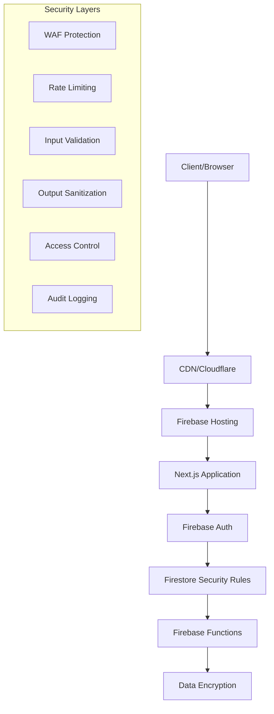

# 🔐 Guide de Sécurité - CuisineZen

Ce document présente les mesures de sécurité implémentées dans CuisineZen, les bonnes pratiques à suivre, et les procédures d'audit de sécurité.

## 📋 Table des matières

1. [Vue d'ensemble de la sécurité](#-vue-densemble-de-la-sécurité)
2. [Authentification et autorisation](#-authentification-et-autorisation)
3. [Sécurité des données](#-sécurité-des-données)
4. [Sécurité réseau](#-sécurité-réseau)
5. [Sécurité du code](#-sécurité-du-code)
6. [Gestion des secrets](#-gestion-des-secrets)
7. [Audit et monitoring](#-audit-et-monitoring)
8. [Procédures de réponse aux incidents](#-procédures-de-réponse-aux-incidents)
9. [Conformité et réglementation](#-conformité-et-réglementation)

---

## 🎯 Vue d'ensemble de la sécurité

### Modèle de sécurité

CuisineZen adopte une approche **Defense in Depth** avec plusieurs couches de sécurité :



### Principes de sécurité appliqués

#### 1. Zero Trust Architecture
```typescript
// Chaque requête est vérifiée, même interne
const securityPrinciples = {
  authentication: "Jamais de confiance implicite",
  authorization: "Vérification à chaque niveau",
  validation: "Validation côté client ET serveur",
  encryption: "Chiffrement bout en bout",
  monitoring: "Surveillance continue",
  compliance: "Conformité RGPD native"
};
```

#### 2. Principe du moindre privilège
```typescript
// Permissions granulaires par rôle
interface SecurityModel {
  roles: {
    admin: Permission[];
    manager: Permission[];
    employee: Permission[];
  };
  resources: {
    products: ResourcePermissions;
    recipes: ResourcePermissions;
    analytics: ResourcePermissions;
  };
  temporal: {
    sessionTimeout: number;
    tokenExpiry: number;
    refreshInterval: number;
  };
}
```

### Score de sécurité actuel

| Domaine | Score | Statut | Actions |
|---------|-------|--------|---------|
| 🔐 **Authentification** | 9/10 | ✅ Excellent | Monitoring continu |
| 🛡️ **Autorisation** | 8/10 | ✅ Très bon | Audit permissions |
| 🔒 **Chiffrement** | 9/10 | ✅ Excellent | Rotation clés |
| 🌐 **Réseau** | 8/10 | ✅ Très bon | WAF avancé |
| 📊 **Monitoring** | 7/10 | 🟡 Bon | Alertes avancées |
| 📝 **Compliance** | 9/10 | ✅ Excellent | Audit annuel |

---

## 🔑 Authentification et autorisation

### Architecture d'authentification Firebase

```typescript
// Configuration sécurisée de Firebase Auth
export const authConfig = {
  // Fournisseurs d'authentification sécurisés
  providers: {
    email: {
      enabled: true,
      requireEmailVerification: true,
      passwordPolicy: {
        minLength: 12,
        requireUppercase: true,
        requireLowercase: true,
        requireNumbers: true,
        requireSpecialChars: true,
        preventCommonPasswords: true
      }
    },
    google: {
      enabled: true,
      clientId: process.env.GOOGLE_CLIENT_ID,
      hd: "restaurant-domain.com" // Restriction domaine
    }
  },
  
  // Configuration de session sécurisée
  session: {
    httpOnly: true,
    secure: true,
    sameSite: 'strict',
    maxAge: 4 * 60 * 60 * 1000, // 4 heures
    regenerateOnLogin: true
  },
  
  // Protection contre les attaques
  security: {
    maxLoginAttempts: 5,
    lockoutDuration: 15 * 60 * 1000, // 15 minutes
    bruteForceProtection: true,
    captchaThreshold: 3
  }
};
```

### Gestion des sessions sécurisées

```typescript
// Middleware de vérification de session
export function withSecureSession(handler: NextApiHandler): NextApiHandler {
  return async (req, res) => {
    try {
      // Vérification du token Firebase
      const token = req.headers.authorization?.replace('Bearer ', '');
      if (!token) {
        return res.status(401).json({ error: 'Token manquant' });
      }
      
      // Vérification et décodage du token
      const decodedToken = await admin.auth().verifyIdToken(token);
      
      // Vérification de la révocation
      const userRecord = await admin.auth().getUser(decodedToken.uid);
      if (userRecord.tokensValidAfterTime && 
          new Date(decodedToken.iat * 1000) < new Date(userRecord.tokensValidAfterTime)) {
        return res.status(401).json({ error: 'Token révoqué' });
      }
      
      // Vérification de l'expiration de session
      const sessionAge = Date.now() - (decodedToken.iat * 1000);
      if (sessionAge > authConfig.session.maxAge) {
        return res.status(401).json({ error: 'Session expirée' });
      }
      
      // Injection des données utilisateur
      (req as any).user = {
        uid: decodedToken.uid,
        email: decodedToken.email,
        emailVerified: decodedToken.email_verified,
        customClaims: decodedToken
      };
      
      return handler(req, res);
    } catch (error) {
      console.error('Erreur vérification session:', error);
      return res.status(401).json({ error: 'Session invalide' });
    }
  };
}
```

### Système de permissions granulaires

```typescript
// Définition des permissions détaillées
export interface UserPermissions {
  // Permissions produits
  products: {
    view: boolean;
    create: boolean;
    edit: boolean;
    delete: boolean;
    export: boolean;
    viewSensitiveData: boolean; // Prix, coûts
  };
  
  // Permissions recettes
  recipes: {
    view: boolean;
    create: boolean;
    edit: boolean;
    editOwn: boolean;
    delete: boolean;
    deleteOwn: boolean;
    viewPrivate: boolean;
  };
  
  // Permissions utilisateurs
  users: {
    view: boolean;
    create: boolean;
    edit: boolean;
    delete: boolean;
    managePermissions: boolean;
    viewAuditLog: boolean;
  };
  
  // Permissions système
  system: {
    viewAnalytics: boolean;
    viewFinancialData: boolean;
    exportData: boolean;
    manageSettings: boolean;
    accessApi: boolean;
  };
}

// Matrice de permissions par rôle
export const ROLE_PERMISSIONS: Record<UserRole, UserPermissions> = {
  admin: {
    products: {
      view: true,
      create: true,
      edit: true,
      delete: true,
      export: true,
      viewSensitiveData: true
    },
    recipes: {
      view: true,
      create: true,
      edit: true,
      editOwn: true,
      delete: true,
      deleteOwn: true,
      viewPrivate: true
    },
    users: {
      view: true,
      create: true,
      edit: true,
      delete: true,
      managePermissions: true,
      viewAuditLog: true
    },
    system: {
      viewAnalytics: true,
      viewFinancialData: true,
      exportData: true,
      manageSettings: true,
      accessApi: true
    }
  },
  
  manager: {
    products: {
      view: true,
      create: true,
      edit: true,
      delete: false, // Protection contre suppression accidentelle
      export: true,
      viewSensitiveData: true
    },
    recipes: {
      view: true,
      create: true,
      edit: true,
      editOwn: true,
      delete: false,
      deleteOwn: true,
      viewPrivate: false
    },
    users: {
      view: true,
      create: false,
      edit: false,
      delete: false,
      managePermissions: false,
      viewAuditLog: false
    },
    system: {
      viewAnalytics: true,
      viewFinancialData: false,
      exportData: false,
      manageSettings: false,
      accessApi: false
    }
  },
  
  employee: {
    products: {
      view: true,
      create: true,
      edit: true,
      delete: false,
      export: false,
      viewSensitiveData: false
    },
    recipes: {
      view: true,
      create: false,
      edit: false,
      editOwn: true,
      delete: false,
      deleteOwn: true,
      viewPrivate: false
    },
    users: {
      view: false,
      create: false,
      edit: false,
      delete: false,
      managePermissions: false,
      viewAuditLog: false
    },
    system: {
      viewAnalytics: false,
      viewFinancialData: false,
      exportData: false,
      manageSettings: false,
      accessApi: false
    }
  }
};
```

### Protection des routes et composants

```tsx
// HOC pour protection avancée des composants
export function withAdvancedPermission(
  permissions: Array<keyof UserPermissions>,
  options: {
    requireAll?: boolean;
    fallbackComponent?: React.ComponentType;
    redirectTo?: string;
  } = {}
) {
  return function <T extends {}>(Component: React.ComponentType<T>) {
    return function ProtectedComponent(props: T) {
      const { user, userPermissions, loading } = useAuth();
      const { requireAll = false, fallbackComponent: Fallback, redirectTo } = options;
      
      // Chargement
      if (loading) return <LoadingSpinner />;
      
      // Non authentifié
      if (!user) {
        if (redirectTo) {
          redirect(redirectTo);
          return null;
        }
        return <LoginRequired />;
      }
      
      // Vérification des permissions
      const hasPermissions = requireAll
        ? permissions.every(permission => checkNestedPermission(userPermissions, permission))
        : permissions.some(permission => checkNestedPermission(userPermissions, permission));
      
      if (!hasPermissions) {
        if (Fallback) return <Fallback {...props} />;
        return <UnauthorizedAccess requiredPermissions={permissions} />;
      }
      
      return <Component {...props} />;
    };
  };
}

// Utilitaire pour vérifier les permissions imbriquées
function checkNestedPermission(permissions: UserPermissions, path: string): boolean {
  const parts = path.split('.');
  let current: any = permissions;
  
  for (const part of parts) {
    if (current[part] === undefined) return false;
    current = current[part];
  }
  
  return Boolean(current);
}

// Usage
const AdminUserManagement = withAdvancedPermission(
  ['users.view', 'users.managePermissions'],
  { 
    requireAll: true,
    fallbackComponent: InsufficientPermissions,
    redirectTo: '/dashboard'
  }
)(UserManagementComponent);
```

---

## 🔒 Sécurité des données

### Chiffrement des données

```typescript
// Service de chiffrement pour données sensibles
class EncryptionService {
  private readonly algorithm = 'aes-256-gcm';
  private readonly keyDerivation = 'pbkdf2';
  
  // Chiffrement des données sensibles avant stockage
  async encryptSensitiveData(data: any, context: string): Promise<EncryptedData> {
    const key = await this.deriveKey(context);
    const iv = crypto.randomBytes(12);
    const cipher = crypto.createCipher(this.algorithm, key, { iv });
    
    let encrypted = cipher.update(JSON.stringify(data), 'utf8', 'hex');
    encrypted += cipher.final('hex');
    
    const authTag = cipher.getAuthTag();
    
    return {
      data: encrypted,
      iv: iv.toString('hex'),
      authTag: authTag.toString('hex'),
      algorithm: this.algorithm,
      timestamp: Date.now()
    };
  }
  
  // Déchiffrement des données
  async decryptSensitiveData(encryptedData: EncryptedData, context: string): Promise<any> {
    const key = await this.deriveKey(context);
    const iv = Buffer.from(encryptedData.iv, 'hex');
    const authTag = Buffer.from(encryptedData.authTag, 'hex');
    
    const decipher = crypto.createDecipher(this.algorithm, key, { iv });
    decipher.setAuthTag(authTag);
    
    let decrypted = decipher.update(encryptedData.data, 'hex', 'utf8');
    decrypted += decipher.final('utf8');
    
    return JSON.parse(decrypted);
  }
  
  // Dérivation de clé sécurisée
  private async deriveKey(context: string): Promise<Buffer> {
    const masterKey = process.env.ENCRYPTION_MASTER_KEY!;
    const salt = crypto.createHash('sha256').update(context).digest();
    
    return new Promise((resolve, reject) => {
      crypto.pbkdf2(masterKey, salt, 100000, 32, 'sha512', (err, derivedKey) => {
        if (err) reject(err);
        else resolve(derivedKey);
      });
    });
  }
}
```

### Protection des données personnelles (RGPD)

```typescript
// Service de conformité RGPD
class GDPRComplianceService {
  // Anonymisation des données utilisateur
  async anonymizeUserData(userId: string): Promise<void> {
    const anonymizedData = {
      id: `anon_${crypto.randomUUID()}`,
      email: `anonymized_${Date.now()}@deleted.local`,
      name: '[Utilisateur supprimé]',
      createdAt: null,
      lastLoginAt: null,
      personalData: null
    };
    
    // Mise à jour de toutes les références
    await this.updateUserReferences(userId, anonymizedData);
    
    // Log de l'anonymisation
    await this.logGDPRAction('anonymize', userId, 'User data anonymized per GDPR request');
  }
  
  // Export des données utilisateur (Droit à la portabilité)
  async exportUserData(userId: string): Promise<UserDataExport> {
    const userData = await this.collectAllUserData(userId);
    
    return {
      exportDate: new Date().toISOString(),
      userId,
      personalData: userData.profile,
      activityData: userData.activities,
      contentData: {
        recipes: userData.recipes,
        products: userData.products,
        menus: userData.menus
      },
      metadata: {
        dataFormat: 'JSON',
        exportVersion: '1.0',
        retention: userData.retentionPolicy
      }
    };
  }
  
  // Suppression des données (Droit à l'oubli)
  async deleteUserData(userId: string, reason: string): Promise<void> {
    // Vérification des contraintes légales
    await this.checkDeletionConstraints(userId);
    
    // Suppression en cascade sécurisée
    await this.deleteCascade(userId);
    
    // Log irréversible de la suppression
    await this.logGDPRAction('delete', userId, reason);
  }
  
  // Consentement et traçabilité
  async recordConsent(userId: string, consentData: ConsentData): Promise<void> {
    const consentRecord = {
      userId,
      consentId: crypto.randomUUID(),
      timestamp: new Date(),
      ipAddress: this.hashIP(consentData.ipAddress),
      userAgent: this.hashUserAgent(consentData.userAgent),
      consentType: consentData.type,
      consentText: consentData.text,
      consentVersion: consentData.version,
      processingPurposes: consentData.purposes,
      dataCategories: consentData.dataCategories,
      withdrawalMethod: 'available',
      signature: await this.signConsent(consentData)
    };
    
    await this.storeConsentRecord(consentRecord);
  }
}
```

### Règles de sécurité Firestore avancées

```javascript
// firestore.rules - Règles de sécurité robustes
rules_version = '2';
service cloud.firestore {
  match /databases/{database}/documents {
    
    // Fonctions de sécurité partagées
    function isAuthenticated() {
      return request.auth != null;
    }
    
    function isOwner(userId) {
      return isAuthenticated() && request.auth.uid == userId;
    }
    
    function isValidEmail() {
      return isAuthenticated() && 
             request.auth.token.email != null &&
             request.auth.token.email_verified == true;
    }
    
    function hasPermission(restaurantId, permission) {
      return isAuthenticated() && 
             exists(/databases/$(database)/documents/restaurants/$(restaurantId)/users/$(request.auth.token.email)) &&
             get(/databases/$(database)/documents/restaurants/$(restaurantId)/users/$(request.auth.token.email)).data.permissions[permission] == true;
    }
    
    function isAdminOrOwner(restaurantId, resourceOwnerId) {
      return isAuthenticated() && (
        isAdmin(restaurantId) ||
        request.auth.uid == resourceOwnerId
      );
    }
    
    function isAdmin(restaurantId) {
      return isAuthenticated() && 
             get(/databases/$(database)/documents/restaurants/$(restaurantId)).data.adminEmails.hasAny([request.auth.token.email]);
    }
    
    function validateDataIntegrity(data) {
      return data.keys().hasAll(['createdAt', 'updatedAt', 'createdBy']) &&
             data.createdAt is timestamp &&
             data.updatedAt is timestamp &&
             data.createdBy is string;
    }
    
    function preventDataTampering(oldData, newData) {
      return oldData.createdAt == newData.createdAt &&
             oldData.createdBy == newData.createdBy &&
             newData.updatedAt == request.time;
    }
    
    // Règles pour les restaurants
    match /restaurants/{restaurantId} {
      allow read: if isAuthenticated() && (
        isAdmin(restaurantId) ||
        exists(/databases/$(database)/documents/restaurants/$(restaurantId)/users/$(request.auth.token.email))
      );
      
      allow write: if isAdmin(restaurantId) && 
                      validateDataIntegrity(request.resource.data);
      
      // Produits avec permissions granulaires
      match /products/{productId} {
        allow read: if hasPermission(restaurantId, 'products.view');
        
        allow create: if hasPermission(restaurantId, 'products.create') &&
                         validateDataIntegrity(request.resource.data) &&
                         request.resource.data.restaurantId == restaurantId;
        
        allow update: if hasPermission(restaurantId, 'products.edit') &&
                         preventDataTampering(resource.data, request.resource.data);
        
        allow delete: if hasPermission(restaurantId, 'products.delete');
      }
      
      // Recettes avec propriété
      match /recipes/{recipeId} {
        allow read: if hasPermission(restaurantId, 'recipes.view');
        
        allow create: if hasPermission(restaurantId, 'recipes.create') &&
                         validateDataIntegrity(request.resource.data) &&
                         request.resource.data.restaurantId == restaurantId &&
                         request.resource.data.createdBy == request.auth.uid;
        
        allow update: if (
          hasPermission(restaurantId, 'recipes.edit') ||
          (hasPermission(restaurantId, 'recipes.editOwn') && resource.data.createdBy == request.auth.uid)
        ) && preventDataTampering(resource.data, request.resource.data);
        
        allow delete: if (
          hasPermission(restaurantId, 'recipes.delete') ||
          (hasPermission(restaurantId, 'recipes.deleteOwn') && resource.data.createdBy == request.auth.uid)
        );
      }
      
      // Utilisateurs (accès restreint)
      match /users/{userEmail} {
        allow read: if isAuthenticated() && (
          request.auth.token.email == userEmail ||
          hasPermission(restaurantId, 'users.view')
        );
        
        allow write: if isAdmin(restaurantId);
      }
      
      // Logs d'audit (lecture seule pour admins)
      match /auditLog/{logId} {
        allow read: if hasPermission(restaurantId, 'system.viewAuditLog');
        allow write: if false; // Uniquement via Functions
      }
    }
    
    // Collection globale des utilisateurs (données personnelles)
    match /users/{userId} {
      allow read, write: if isOwner(userId);
      allow create: if isAuthenticated() && request.auth.uid == userId;
    }
    
    // Règles de limitation du taux de requêtes
    match /{document=**} {
      allow read, write: if resource == null || 
        (resource.data.lastAccess == null || 
         request.time > resource.data.lastAccess + duration.value(1, 's'));
    }
  }
}
```

---

## 🌐 Sécurité réseau

### Configuration HTTPS et sécurité de transport

```typescript
// Configuration de sécurité réseau
const networkSecurity = {
  // HTTPS obligatoire
  httpsRedirect: true,
  
  // Headers de sécurité
  securityHeaders: {
    'Strict-Transport-Security': 'max-age=31536000; includeSubDomains; preload',
    'X-Frame-Options': 'DENY',
    'X-Content-Type-Options': 'nosniff',
    'X-XSS-Protection': '1; mode=block',
    'Referrer-Policy': 'strict-origin-when-cross-origin',
    'Permissions-Policy': 'camera=(), microphone=(), geolocation=()',
    'Content-Security-Policy': `
      default-src 'self';
      script-src 'self' 'unsafe-inline' https://apis.google.com;
      style-src 'self' 'unsafe-inline' https://fonts.googleapis.com;
      font-src 'self' https://fonts.gstatic.com;
      img-src 'self' data: https://firebasestorage.googleapis.com;
      connect-src 'self' https://*.googleapis.com https://*.firebase.com;
      frame-src 'none';
      object-src 'none';
      base-uri 'self';
      form-action 'self';
    `.replace(/\s+/g, ' ').trim()
  },
  
  // Protection contre les attaques
  rateLimiting: {
    windowMs: 15 * 60 * 1000, // 15 minutes
    max: 100, // Limite par IP
    message: 'Trop de requêtes, réessayez plus tard',
    standardHeaders: true,
    legacyHeaders: false
  }
};
```

### Protection contre les attaques courantes

```typescript
// Middleware de protection globale
export function securityMiddleware(req: NextRequest): NextResponse {
  const response = NextResponse.next();
  
  // Protection CSRF
  if (req.method !== 'GET') {
    const csrfToken = req.headers.get('x-csrf-token');
    const sessionToken = req.cookies.get('csrf-token')?.value;
    
    if (!csrfToken || !sessionToken || csrfToken !== sessionToken) {
      return new Response('CSRF token mismatch', { status: 403 });
    }
  }
  
  // Protection XSS
  const userAgent = req.headers.get('user-agent') || '';
  if (detectXSSPattern(userAgent)) {
    return new Response('Suspicious request detected', { status:403 });
  }
  
  // Protection injection SQL (pour requêtes personnalisées)
  const queryParams = req.nextUrl.searchParams.toString();
  if (detectSQLInjection(queryParams)) {
    return new Response('Invalid query parameters', { status: 400 });
  }
  
  // Application des headers de sécurité
  Object.entries(networkSecurity.securityHeaders).forEach(([key, value]) => {
    response.headers.set(key, value);
  });
  
  return response;
}

// Détection de patterns malveillants
function detectXSSPattern(input: string): boolean {
  const xssPatterns = [
    /<script[^>]*>.*?<\/script>/gi,
    /javascript:/gi,
    /on\w+\s*=/gi,
    /<iframe[^>]*>.*?<\/iframe>/gi
  ];
  
  return xssPatterns.some(pattern => pattern.test(input));
}

function detectSQLInjection(input: string): boolean {
  const sqlPatterns = [
    /(\b(SELECT|INSERT|UPDATE|DELETE|DROP|CREATE|ALTER|EXEC)\b)/gi,
    /(UNION|OR\s+1=1|AND\s+1=1)/gi,
    /('|('')|;|--|\/\*|\*\/)/gi
  ];
  
  return sqlPatterns.some(pattern => pattern.test(input));
}
```

### Rate limiting et protection DDoS

```typescript
// Service de rate limiting avancé
class RateLimitService {
  private redis: Redis;
  private limits: Map<string, RateLimit> = new Map();
  
  constructor() {
    this.redis = new Redis(process.env.REDIS_URL);
    this.setupDefaultLimits();
  }
  
  private setupDefaultLimits(): void {
    // Limites par type d'opération
    this.limits.set('api.general', { 
      requests: 100, 
      window: 900, // 15 minutes
      burst: 20 
    });
    
    this.limits.set('api.auth', { 
      requests: 10, 
      window: 900, 
      burst: 3 
    });
    
    this.limits.set('api.upload', { 
      requests: 20, 
      window: 3600, // 1 heure
      burst: 5 
    });
    
    this.limits.set('ai.requests', { 
      requests: 50, 
      window: 3600, 
      burst: 10 
    });
  }
  
  async checkLimit(
    identifier: string, 
    operation: string,
    ip?: string
  ): Promise<RateLimitResult> {
    const limit = this.limits.get(operation) || this.limits.get('api.general')!;
    const key = `rate_limit:${operation}:${identifier}`;
    
    // Algorithme sliding window avec Redis
    const now = Date.now();
    const window = limit.window * 1000;
    const cutoff = now - window;
    
    const pipeline = this.redis.pipeline();
    
    // Nettoyer les anciennes entrées
    pipeline.zremrangebyscore(key, '-inf', cutoff);
    
    // Compter les requêtes dans la fenêtre
    pipeline.zcard(key);
    
    // Ajouter la requête actuelle
    pipeline.zadd(key, now, `${now}-${Math.random()}`);
    
    // Définir l'expiration
    pipeline.expire(key, limit.window);
    
    const results = await pipeline.exec();
    const currentCount = (results![1][1] as number) + 1;
    
    // Vérifier les limites
    const allowed = currentCount <= limit.requests;
    const resetTime = new Date(now + window);
    
    // Protection contre les burst attacks
    if (!allowed && ip) {
      await this.handleBurstAttack(ip, operation);
    }
    
    return {
      allowed,
      limit: limit.requests,
      remaining: Math.max(0, limit.requests - currentCount),
      resetTime,
      retryAfter: allowed ? null : Math.ceil(window / 1000)
    };
  }
  
  private async handleBurstAttack(ip: string, operation: string): Promise<void> {
    const burstKey = `burst_attack:${ip}:${operation}`;
    const burstCount = await this.redis.incr(burstKey);
    
    if (burstCount === 1) {
      await this.redis.expire(burstKey, 3600); // 1 heure
    }
    
    // Bannissement temporaire après 3 burst attacks
    if (burstCount >= 3) {
      await this.temporaryBan(ip, 3600); // 1 heure
      await this.alertSecurityTeam('burst_attack', { ip, operation, count: burstCount });
    }
  }
  
  private async temporaryBan(ip: string, duration: number): Promise<void> {
    const banKey = `banned_ip:${ip}`;
    await this.redis.setex(banKey, duration, 'burst_attack');
  }
  
  async isBanned(ip: string): Promise<boolean> {
    const banned = await this.redis.exists(`banned_ip:${ip}`);
    return banned === 1;
  }
}
```

---

## 💻 Sécurité du code

### Analyse statique et linting de sécurité

```json
// .eslintrc.security.json - Configuration ESLint sécurisée
{
  "extends": [
    "eslint:recommended",
    "@typescript-eslint/recommended",
    "plugin:security/recommended",
    "plugin:react-hooks/recommended"
  ],
  "plugins": [
    "security",
    "no-secrets",
    "anti-trojan-source"
  ],
  "rules": {
    // Sécurité générale
    "security/detect-object-injection": "error",
    "security/detect-non-literal-regexp": "warn",
    "security/detect-unsafe-regex": "error",
    "security/detect-buffer-noassert": "error",
    "security/detect-child-process": "error",
    "security/detect-disable-mustache-escape": "error",
    "security/detect-eval-with-expression": "error",
    "security/detect-no-csrf-before-method-override": "error",
    "security/detect-possible-timing-attacks": "warn",
    "security/detect-pseudoRandomBytes": "error",
    
    // Détection de secrets
    "no-secrets/no-secrets": ["error", {
      "tolerance": 4.2,
      "additionalRegexes": {
        "Firebase API Key": "AIza[0-9A-Za-z\\-_]{35}",
        "Firebase Auth Domain": "[a-z0-9-]+\\.firebaseapp\\.com",
        "Private Key": "-----BEGIN (RSA )?PRIVATE KEY-----"
      }
    }],
    
    // Protection contre Unicode malveillant
    "anti-trojan-source/no-bidi": "error",
    
    // TypeScript sécurisé
    "@typescript-eslint/no-explicit-any": "error",
    "@typescript-eslint/no-unsafe-assignment": "error",
    "@typescript-eslint/no-unsafe-call": "error",
    "@typescript-eslint/no-unsafe-member-access": "error",
    "@typescript-eslint/no-unsafe-return": "error"
  }
}
```

### Validation et sanitisation des entrées

```typescript
// Service de validation sécurisée
class SecureValidation {
  // Schémas Zod avec validation de sécurité
  static readonly productSchema = z.object({
    name: z.string()
      .min(1, 'Nom requis')
      .max(100, 'Nom trop long')
      .regex(/^[a-zA-Z0-9\s\-\.À-ÿ]+$/, 'Caractères non autorisés')
      .transform(this.sanitizeString),
    
    category: z.enum(['frais', 'surgelé', 'épicerie', 'boisson', 'entretien']),
    
    batches: z.array(z.object({
      id: z.string().uuid('ID invalide'),
      quantity: z.number()
        .positive('Quantité doit être positive')
        .max(999999, 'Quantité trop élevée'),
      expiryDate: z.date()
        .nullable()
        .refine(date => !date || date > new Date(), 'Date passée')
    })).min(1, 'Au moins un lot requis')
  });
  
  static readonly recipeSchema = z.object({
    name: z.string()
      .min(1)
      .max(100)
      .transform(this.sanitizeString),
    
    description: z.string()
      .max(1000)
      .transform(this.sanitizeHTML),
    
    ingredients: z.array(z.object({
      productId: z.string().uuid(),
      quantity: z.number().positive().max(10000),
      unit: z.enum(['g', 'ml', 'piece'])
    })),
    
    preparationTime: z.number().int().min(1).max(1440).optional(),
    cookingTime: z.number().int().min(1).max(1440).optional(),
    difficulty: z.enum(['facile', 'moyen', 'difficile']).optional()
  });
  
  // Sanitisation sécurisée des strings
  private static sanitizeString(str: string): string {
    return str
      .trim()
      .replace(/<[^>]*>/g, '') // Supprimer HTML
      .replace(/[<>\"'&]/g, '') // Caractères dangereux
      .replace(/\s+/g, ' ') // Normaliser espaces
      .substring(0, 1000); // Limiter longueur
  }
  
  // Sanitisation HTML avec whitelist
  private static sanitizeHTML(html: string): string {
    const allowedTags = ['b', 'i', 'em', 'strong', 'br'];
    const allowedAttributes: Record<string, string[]> = {};
    
    return DOMPurify.sanitize(html, {
      ALLOWED_TAGS: allowedTags,
      ALLOWED_ATTR: allowedAttributes,
      FORBID_SCRIPTS: true,
      FORBID_TAGS: ['script', 'object', 'embed', 'link'],
      FORBID_ATTR: ['style', 'onerror', 'onclick']
    });
  }
  
  // Validation avec rapport d'erreurs détaillé
  static validateWithSecurity<T>(
    data: unknown, 
    schema: z.ZodSchema<T>
  ): SecurityValidationResult<T> {
    try {
      const validated = schema.parse(data);
      return {
        success: true,
        data: validated,
        securityIssues: []
      };
    } catch (error) {
      if (error instanceof z.ZodError) {
        const securityIssues = this.analyzeSecurityIssues(error, data);
        return {
          success: false,
          errors: error.errors,
          securityIssues
        };
      }
      throw error;
    }
  }
  
  private static analyzeSecurityIssues(error: z.ZodError, data: unknown): SecurityIssue[] {
    const issues: SecurityIssue[] = [];
    
    // Analyser les patterns suspects
    const dataStr = JSON.stringify(data);
    
    if (/<script/i.test(dataStr)) {
      issues.push({
        type: 'xss_attempt',
        severity: 'high',
        description: 'Script tags detected in input'
      });
    }
    
    if (/(union|select|insert|delete|drop)/i.test(dataStr)) {
      issues.push({
        type: 'sql_injection_attempt',
        severity: 'high', 
        description: 'SQL keywords detected in input'
      });
    }
    
    if (dataStr.length > 10000) {
      issues.push({
        type: 'oversized_payload',
        severity: 'medium',
        description: 'Suspiciously large payload'
      });
    }
    
    return issues;
  }
}
```

### Audit de dépendances et sécurité

```json
// package.json - Scripts de sécurité
{
  "scripts": {
    "security:audit": "npm audit --audit-level moderate",
    "security:fix": "npm audit fix",
    "security:scan": "npm run security:audit && npm run security:secrets && npm run security:dependencies",
    "security:secrets": "npx secretlint '**/*'",
    "security:dependencies": "npx better-npm-audit audit --level moderate",
    "security:licenses": "npx license-checker --onlyAllow 'MIT;Apache-2.0;BSD-2-Clause;BSD-3-Clause;ISC'",
    "test:security": "jest --testPathPattern=security"
  },
  "devDependencies": {
    "better-npm-audit": "^3.7.3",
    "secretlint": "^6.2.4",
    "license-checker": "^25.0.1",
    "@typescript-eslint/eslint-plugin": "^6.4.0",
    "eslint-plugin-security": "^1.7.1",
    "eslint-plugin-no-secrets": "^0.8.9"
  }
}
```

---

## 🔐 Gestion des secrets

### Stockage sécurisé des secrets

```typescript
// Service de gestion des secrets
class SecretManager {
  private readonly gcpSecretManager: SecretManagerServiceClient;
  private readonly cache: Map<string, CachedSecret> = new Map();
  
  constructor() {
    this.gcpSecretManager = new SecretManagerServiceClient();
  }
  
  // Récupération sécurisée des secrets
  async getSecret(secretName: string): Promise<string> {
    // Vérifier le cache d'abord
    const cached = this.cache.get(secretName);
    if (cached && cached.expiresAt > Date.now()) {
      return cached.value;
    }
    
    try {
      // Récupérer depuis Google Secret Manager
      const [version] = await this.gcpSecretManager.accessSecretVersion({
        name: `projects/${process.env.GCP_PROJECT_ID}/secrets/${secretName}/versions/latest`
      });
      
      const secretValue = version.payload?.data?.toString();
      if (!secretValue) {
        throw new Error(`Secret ${secretName} is empty`);
      }
      
      // Mettre en cache avec expiration
      this.cache.set(secretName, {
        value: secretValue,
        expiresAt: Date.now() + (5 * 60 * 1000) // 5 minutes
      });
      
      return secretValue;
    } catch (error) {
      console.error(`Failed to retrieve secret ${secretName}:`, error);
      throw new Error('Secret retrieval failed');
    }
  }
  
  // Rotation automatique des secrets
  async rotateSecret(secretName: string, newValue: string): Promise<void> {
    try {
      // Créer nouvelle version
      await this.gcpSecretManager.addSecretVersion({
        parent: `projects/${process.env.GCP_PROJECT_ID}/secrets/${secretName}`,
        payload: {
          data: Buffer.from(newValue)
        }
      });
      
      // Invalider le cache
      this.cache.delete(secretName);
      
      // Log de la rotation
      await this.logSecretRotation(secretName);
      
    } catch (error) {
      console.error(`Failed to rotate secret ${secretName}:`, error);
      throw error;
    }
  }
  
  // Audit des accès aux secrets
  private async logSecretAccess(secretName: string, operation: string): Promise<void> {
    const auditEntry = {
      timestamp: new Date(),
      secretName,
      operation,
      requestId: crypto.randomUUID(),
      source: 'secret-manager',
      environment: process.env.NODE_ENV
    };
    
    // Log dans système d'audit sécurisé
    await this.writeSecureAuditLog(auditEntry);
  }
}
```

### Configuration d'environnement sécurisée

```typescript
// config/secure-config.ts
interface SecureConfig {
  firebase: {
    apiKey: string;
    authDomain: string;
    projectId: string;
    storageBucket: string;
    messagingSenderId: string;
    appId: string;
  };
  encryption: {
    masterKey: string;
    keyRotationInterval: number;
  };
  external: {
    geminiApiKey: string;
    barcodeApiKey?: string;
  };
  monitoring: {
    sentryDsn?: string;
    datadogApiKey?: string;
  };
}

class SecureConfigManager {
  private config: SecureConfig | null = null;
  private secretManager: SecretManager;
  
  constructor() {
    this.secretManager = new SecretManager();
  }
  
  async getConfig(): Promise<SecureConfig> {
    if (this.config) return this.config;
    
    // Validation de l'environnement
    this.validateEnvironment();
    
    // Chargement sécurisé des secrets
    this.config = {
      firebase: {
        apiKey: await this.secretManager.getSecret('firebase-api-key'),
        authDomain: await this.secretManager.getSecret('firebase-auth-domain'),
        projectId: process.env.FIREBASE_PROJECT_ID!,
        storageBucket: await this.secretManager.getSecret('firebase-storage-bucket'),
        messagingSenderId: await this.secretManager.getSecret('firebase-messaging-sender-id'),
        appId: await this.secretManager.getSecret('firebase-app-id')
      },
      encryption: {
        masterKey: await this.secretManager.getSecret('encryption-master-key'),
        keyRotationInterval: 90 * 24 * 60 * 60 * 1000 // 90 jours
      },
      external: {
        geminiApiKey: await this.secretManager.getSecret('gemini-api-key'),
        barcodeApiKey: await this.secretManager.getSecret('barcode-api-key').catch(() => undefined)
      },
      monitoring: {
        sentryDsn: await this.secretManager.getSecret('sentry-dsn').catch(() => undefined),
        datadogApiKey: await this.secretManager.getSecret('datadog-api-key').catch(() => undefined)
      }
    };
    
    return this.config;
  }
  
  private validateEnvironment(): void {
    const required = [
      'NODE_ENV',
      'FIREBASE_PROJECT_ID',
      'GCP_PROJECT_ID'
    ];
    
    for (const env of required) {
      if (!process.env[env]) {
        throw new Error(`Missing required environment variable: ${env}`);
      }
    }
    
    // Validation de l'environnement de production
    if (process.env.NODE_ENV === 'production') {
      if (!process.env.GOOGLE_APPLICATION_CREDENTIALS) {
        throw new Error('Production environment requires service account credentials');
      }
    }
  }
  
  // Masquage des secrets dans les logs
  maskSecrets(data: any): any {
    const sensitiveKeys = [
      'apiKey', 'secret', 'password', 'token', 'key', 'credential',
      'auth', 'private', 'signature', 'hash', 'salt'
    ];
    
    const masked = JSON.parse(JSON.stringify(data));
    
    function maskRecursive(obj: any): void {
      for (const [key, value] of Object.entries(obj)) {
        if (typeof value === 'string' && sensitiveKeys.some(sk => 
          key.toLowerCase().includes(sk)
        )) {
          obj[key] = '*'.repeat(8);
        } else if (typeof value === 'object' && value !== null) {
          maskRecursive(value);
        }
      }
    }
    
    maskRecursive(masked);
    return masked;
  }
}

export const secureConfig = new SecureConfigManager();
```

---

## 📊 Audit et monitoring

### Système d'audit complet

```typescript
// Service d'audit de sécurité
class SecurityAuditService {
  private readonly auditCollection = 'securityAudit';
  
  // Enregistrement des événements de sécurité
  async logSecurityEvent(event: SecurityEvent): Promise<void> {
    const auditEntry: SecurityAuditEntry = {
      id: crypto.randomUUID(),
      timestamp: new Date(),
      type: event.type,
      severity: event.severity,
      actor: {
        userId: event.userId,
        email: event.userEmail,
        ip: this.hashIP(event.ipAddress),
        userAgent: this.hashUserAgent(event.userAgent)
      },
      resource: event.resource,
      action: event.action,
      outcome: event.outcome,
      details: event.details,
      context: {
        sessionId: event.sessionId,
        requestId: event.requestId,
        environment: process.env.NODE_ENV
      },
      metadata: {
        version: '1.0',
        source: 'security-audit-service'
      }
    };
    
    // Stockage sécurisé
    await this.storeAuditEntry(auditEntry);
    
    // Alertes en temps réel pour événements critiques
    if (event.severity === 'critical' || event.severity === 'high') {
      await this.triggerSecurityAlert(auditEntry);
    }
  }
  
  // Types d'événements de sécurité
  async logAuthenticationEvent(event: AuthEvent): Promise<void> {
    await this.logSecurityEvent({
      type: 'authentication',
      severity: event.success ? 'info' : 'warning',
      userId: event.userId,
      userEmail: event.email,
      ipAddress: event.ipAddress,
      userAgent: event.userAgent,
      action: event.action, // login, logout, failed_login
      outcome: event.success ? 'success' : 'failure',
      details: {
        method: event.method,
        provider: event.provider,
        attempts: event.attempts,
        reason: event.failureReason
      }
    });
  }
  
  async logAuthorizationEvent(event: AuthzEvent): Promise<void> {
    await this.logSecurityEvent({
      type: 'authorization',
      severity: event.granted ? 'info' : 'warning',
      userId: event.userId,
      userEmail: event.userEmail,
      ipAddress: event.ipAddress,
      resource: {
        type: event.resourceType,
        id: event.resourceId,
        action: event.requestedAction
      },
      action: 'permission_check',
      outcome: event.granted ? 'granted' : 'denied',
      details: {
        requiredPermissions: event.requiredPermissions,
        userPermissions: event.userPermissions,
        reason: event.denialReason
      }
    });
  }
  
  async logDataAccessEvent(event: DataAccessEvent): Promise<void> {
    await this.logSecurityEvent({
      type: 'data_access',
      severity: 'info',
      userId: event.userId,
      userEmail: event.userEmail,
      resource: {
        type: event.dataType,
        id: event.recordId,
        action: event.operation
      },
      action: event.operation, // read, create, update, delete
      outcome: 'success',
      details: {
        fieldsAccessed: event.fieldsAccessed,
        queryParameters: event.queryParameters,
        resultCount: event.resultCount
      }
    });
  }
  
  // Détection d'anomalies
  async detectAnomalies(): Promise<SecurityAnomaly[]> {
    const timeWindow = 24 * 60 * 60 * 1000; // 24 heures
    const now = Date.now();
    const since = new Date(now - timeWindow);
    
    const recentEvents = await this.getAuditEvents(since);
    const anomalies: SecurityAnomaly[] = [];
    
    // Détection de tentatives de connexion multiples
    const failedLogins = recentEvents.filter(e => 
      e.type === 'authentication' && 
      e.outcome === 'failure'
    );
    
    const failedLoginsByIP = this.groupBy(failedLogins, 'actor.ip');
    
    for (const [ip, events] of Object.entries(failedLoginsByIP)) {
      if (events.length >= 10) {
        anomalies.push({
          type: 'brute_force_attack',
          severity: 'high',
          description: `${events.length} failed login attempts from IP ${ip}`,
          evidence: events.slice(0, 5), // Premiers 5 événements
          recommendedAction: 'temporary_ip_ban'
        });
      }
    }
    
    // Détection d'accès suspects aux données
    const dataAccess = recentEvents.filter(e => e.type === 'data_access');
    const massDataAccess = dataAccess.filter(e => 
      e.details?.resultCount && e.details.resultCount > 1000
    );
    
    if (massDataAccess.length > 0) {
      anomalies.push({
        type: 'mass_data_access',
        severity: 'medium',
        description: 'Large data exports detected',
        evidence: massDataAccess,
        recommendedAction: 'review_data_access_permissions'
      });
    }
    
    return anomalies;
  }
  
  // Rapports de sécurité
  async generateSecurityReport(
    period: { start: Date; end: Date }
  ): Promise<SecurityReport> {
    const events = await this.getAuditEvents(period.start, period.end);
    
    return {
      period,
      summary: {
        totalEvents: events.length,
        criticalEvents: events.filter(e => e.severity === 'critical').length,
        highEvents: events.filter(e => e.severity === 'high').length,
        failedAuthentications: events.filter(e => 
          e.type === 'authentication' && e.outcome === 'failure'
        ).length,
        unauthorizedAccess: events.filter(e => 
          e.type === 'authorization' && e.outcome === 'denied'
        ).length
      },
      topRisks: await this.identifyTopRisks(events),
      recommendations: await this.generateRecommendations(events),
      compliance: await this.checkCompliance(events)
    };
  }
}
```

### Monitoring en temps réel

```typescript
// Service de monitoring de sécurité
class SecurityMonitoringService {
  private alertManager: AlertManager;
  private metricsCollector: MetricsCollector;
  
  constructor() {
    this.alertManager = new AlertManager();
    this.metricsCollector = new MetricsCollector();
    this.setupRealTimeMonitoring();
  }
  
  private setupRealTimeMonitoring(): void {
    // Surveillance des métriques en temps réel
    this.metricsCollector.monitor([
      'authentication.failures',
      'authorization.denials', 
      'api.errors.rate',
      'data.access.volume',
      'network.suspicious.requests'
    ]);
    
    // Alertes basées sur des seuils
    this.setupThresholdAlerts();
  }
  
  private setupThresholdAlerts(): void {
    // Alerte échecs authentification
    this.alertManager.createAlert('auth_failures', {
      metric: 'authentication.failures',
      threshold: 50,
      window: '5m',
      severity: 'high',
      action: 'notify_security_team'
    });
    
    // Alerte volume de données suspect
    this.alertManager.createAlert('data_volume', {
      metric: 'data.access.volume',
      threshold: 10000,
      window: '1h',
      severity: 'medium',
      action: 'investigate_data_access'
    });
    
    // Alerte erreurs API élevées
    this.alertManager.createAlert('api_errors', {
      metric: 'api.errors.rate',
      threshold: 0.1, // 10%
      window: '5m',
      severity: 'high',
      action: 'check_system_health'
    });
  }
  
  // Dashboard de sécurité en temps réel
  async getSecurityDashboard(): Promise<SecurityDashboard> {
    const now = new Date();
    const last24h = new Date(now.getTime() - 24 * 60 * 60 * 1000);
    
    const [
      authMetrics,
      accessMetrics,
      systemMetrics,
      activeThreats
    ] = await Promise.all([
      this.getAuthenticationMetrics(last24h, now),
      this.getAccessMetrics(last24h, now),
      this.getSystemMetrics(last24h, now),
      this.getActiveThreats()
    ]);
    
    return {
      timestamp: now,
      status: this.calculateOverallSecurityStatus([
        authMetrics, accessMetrics, systemMetrics
      ]),
      authentication: authMetrics,
      access: accessMetrics,
      system: systemMetrics,
      threats: activeThreats,
      recommendations: await this.getCurrentRecommendations()
    };
  }
  
  private calculateOverallSecurityStatus(metrics: any[]): SecurityStatus {
    const scores = metrics.map(m => m.score);
    const avgScore = scores.reduce((a, b) => a + b, 0) / scores.length;
    
    if (avgScore >= 90) return 'excellent';
    if (avgScore >= 80) return 'good';
    if (avgScore >= 70) return 'fair';
    if (avgScore >= 60) return 'poor';
    return 'critical';
  }
}
```

---

## 🚨 Procédures de réponse aux incidents

### Plan de réponse aux incidents de sécurité

```typescript
// Service de gestion des incidents de sécurité
class SecurityIncidentResponse {
  private incidents: Map<string, SecurityIncident> = new Map();
  private responseTeam: ResponseTeam;
  
  // Classification des incidents
  async classifyIncident(event: SecurityEvent): Promise<IncidentClassification> {
    const classification: IncidentClassification = {
      severity: this.calculateSeverity(event),
      category: this.categorizeIncident(event),
      priority: this.calculatePriority(event),
      estimatedImpact: this.assessImpact(event),
      responseTime: this.getRequiredResponseTime(event)
    };
    
    return classification;
  }
  
  // Réponse automatisée aux incidents
  async respondToIncident(incident: SecurityIncident): Promise<void> {
    const classification = await this.classifyIncident(incident.triggerEvent);
    
    // Mesures immédiates selon la sévérité
    switch (classification.severity) {
      case 'critical':
        await this.criticalIncidentResponse(incident);
        break;
      case 'high':
        await this.highIncidentResponse(incident);
        break;
      case 'medium':
        await this.mediumIncidentResponse(incident);
        break;
      case 'low':
        await this.lowIncidentResponse(incident);
        break;
    }
    
    // Notification de l'équipe
    await this.notifyResponseTeam(incident, classification);
    
    // Démarrage de l'investigation
    await this.startInvestigation(incident);
  }
  
  private async criticalIncidentResponse(incident: SecurityIncident): Promise<void> {
    // Mesures immédiates pour incidents critiques
    
    // 1. Isolement de la menace
    if (incident.sourceIP) {
      await this.emergencyIPBan(incident.sourceIP);
    }
    
    if (incident.affectedUser) {
      await this.emergencyUserSuspension(incident.affectedUser);
    }
    
    // 2. Préservation des preuves
    await this.preserveEvidence(incident);
    
    // 3. Notification immédiate
    await this.sendEmergencyAlert(incident);
    
    // 4. Activation du plan de continuité
    await this.activateBusinessContinuityPlan();
    
    // 5. Communication aux parties prenantes
    await this.notifyStakeholders(incident);
  }
  
  private async highIncidentResponse(incident: SecurityIncident): Promise<void> {
    // Mesures pour incidents de haute priorité
    
    // 1. Confinement de la menace
    if (incident.sourceIP) {
      await this.temporaryIPRestriction(incident.sourceIP, 3600); // 1 heure
    }
    
    // 2. Collecte de données
    await this.gatherIncidentData(incident);
    
    // 3. Notification de l'équipe de sécurité
    await this.alertSecurityTeam(incident);
    
    // 4. Analyse préliminaire
    await this.preliminaryAnalysis(incident);
  }
  
  // Playbooks de réponse par type d'incident
  private async handleDataBreachIncident(incident: SecurityIncident): Promise<void> {
    const playbook = {
      immediate: [
        'Identifier la source de la fuite',
        'Stopper l\'accès non autorisé',
        'Évaluer les données compromises',
        'Préserver les preuves'
      ],
      shortTerm: [
        'Notifier les autorités (CNIL)',
        'Informer les utilisateurs affectés',
        'Renforcer les mesures de sécurité',
        'Conduire l\'analyse forensique'
      ],
      longTerm: [
        'Revoir les politiques de sécurité',
        'Former l\'équipe',
        'Améliorer les contrôles',
        'Mettre à jour la documentation'
      ]
    };
    
    // Exécuter les actions immédiates
    for (const action of playbook.immediate) {
      await this.executePlaybookAction(action, incident);
    }
    
    // Planifier les actions à court terme
    await this.schedulePlaybookActions(playbook.shortTerm, incident);
  }
  
  // Communication de crise
  async manageCommunication(incident: SecurityIncident): Promise<void> {
    const communicationPlan = {
      internal: {
        immediate: ['équipe de sécurité', 'direction technique'],
        h2: ['direction générale', 'équipe juridique'],
        h24: ['tous les employés']
      },
      external: {
        h24: ['autorités de régulation'],
        h72: ['clients affectés', 'partenaires'],
        postIncident: ['public', 'médias']
      }
    };
    
    // Messages préformatés par audience
    const messages = {
      internal: this.generateInternalMessage(incident),
      regulatory: this.generateRegulatoryMessage(incident),
      customer: this.generateCustomerMessage(incident),
      public: this.generatePublicMessage(incident)
    };
    
    // Exécution du plan de communication
    await this.executeCommunicationPlan(communicationPlan, messages);
  }
  
  // Rapport post-incident
  async generatePostIncidentReport(incident: SecurityIncident): Promise<PostIncidentReport> {
    return {
      incident: {
        id: incident.id,
        timeline: await this.buildIncidentTimeline(incident),
        rootCause: await this.determineRootCause(incident),
        impact: await this.assessActualImpact(incident)
      },
      response: {
        actionsLaken: await this.getResponseActions(incident),
        effectiveness: await this.evaluateResponseEffectiveness(incident),
        timeToContainment: this.calculateContainmentTime(incident),
        timeToResolution: this.calculateResolutionTime(incident)
      },
      lessons: {
        whatWorked: await this.identifySuccesses(incident),
        whatFailed: await this.identifyFailures(incident),
        improvements: await this.recommendImprovements(incident)
      },
      actionItems: await this.generateActionItems(incident),
      compliance: await this.checkComplianceRequirements(incident)
    };
  }
}
```

### Automatisation de la réponse

```typescript
// Système automatisé de réponse aux menaces
class AutomatedThreatResponse {
  private rules: Map<string, ResponseRule> = new Map();
  
  constructor() {
    this.setupResponseRules();
  }
  
  private setupResponseRules(): void {
    // Règle: Tentatives de brute force
    this.rules.set('brute_force', {
      condition: (event) => 
        event.type === 'authentication' &&
        event.outcome === 'failure' &&
        this.getFailureCount(event.actor.ip, 300) >= 5, // 5 échecs en 5 min
      action: async (event) => {
        await this.temporaryIPBan(event.actor.ip, 900); // 15 min
        await this.notifySecurityTeam('brute_force_detected', event);
      },
      cooldown: 300 // Pas de re-déclenchement pendant 5 min
    });
    
    // Règle: Accès inhabituel aux données
    this.rules.set('unusual_data_access', {
      condition: (event) =>
        event.type === 'data_access' &&
        event.details?.resultCount > 5000 &&
        this.isUnusualForUser(event.actor.userId, event.details.resultCount),
      action: async (event) => {
        await this.requireAdditionalAuth(event.actor.userId);
        await this.flagForReview(event);
      },
      cooldown: 3600 // 1 heure
    });
    
    // Règle: Tentative d'injection
    this.rules.set('injection_attempt', {
      condition: (event) =>
        event.details?.input &&
        this.detectInjectionPattern(event.details.input),
      action: async (event) => {
        await this.blockRequest(event);
        await this.temporaryUserSuspension(event.actor.userId, 300);
        await this.alertSecurityTeam('injection_attempt', event);
      },
      cooldown: 60
    });
  }
  
  // Évaluation et exécution des règles
  async evaluateEvent(event: SecurityEvent): Promise<void> {
    for (const [ruleId, rule] of this.rules) {
      if (await this.shouldApplyRule(ruleId, rule, event)) {
        try {
          await rule.action(event);
          await this.logRuleExecution(ruleId, event);
        } catch (error) {
          console.error(`Failed to execute rule ${ruleId}:`, error);
          await this.logRuleError(ruleId, event, error);
        }
      }
    }
  }
  
  private async shouldApplyRule(
    ruleId: string, 
    rule: ResponseRule, 
    event: SecurityEvent
  ): Promise<boolean> {
    // Vérifier la cooldown period
    const lastExecution = await this.getLastRuleExecution(ruleId, event.actor);
    if (lastExecution && Date.now() - lastExecution < rule.cooldown * 1000) {
      return false;
    }
    
    // Évaluer la condition
    return rule.condition(event);
  }
  
  // Actions automatisées
  private async temporaryIPBan(ip: string, duration: number): Promise<void> {
    const hashedIP = this.hashIP(ip);
    await redis.setex(`banned_ip:${hashedIP}`, duration, 'automated_response');
    
    // Log de l'action
    await this.logAutomatedAction('ip_ban', { ip: hashedIP, duration });
  }
  
  private async temporaryUserSuspension(
    userId: string, 
    duration: number
  ): Promise<void> {
    await redis.setex(`suspended_user:${userId}`, duration, 'automated_response');
    
    // Révoquer les tokens existants
    await admin.auth().revokeRefreshTokens(userId);
    
    await this.logAutomatedAction('user_suspension', { userId, duration });
  }
  
  private async requireAdditionalAuth(userId: string): Promise<void> {
    // Forcer la double authentification pour la prochaine connexion
    await admin.auth().setCustomUserClaims(userId, {
      requireMFA: true,
      mfaEnforceUntil: Date.now() + (24 * 60 * 60 * 1000) // 24h
    });
    
    await this.logAutomatedAction('enforce_mfa', { userId });
  }
}
```

---

## 📋 Conformité et réglementation

### Conformité RGPD

```typescript
// Service de conformité RGPD
class GDPRComplianceManager {
  // Traitement des demandes RGPD
  async handleGDPRRequest(request: GDPRRequest): Promise<GDPRResponse> {
    switch (request.type) {
      case 'access':
        return await this.handleAccessRequest(request);
      case 'rectification':
        return await this.handleRectificationRequest(request);
      case 'erasure':
        return await this.handleErasureRequest(request);
      case 'portability':
        return await this.handlePortabilityRequest(request);
      case 'restriction':
        return await this.handleRestrictionRequest(request);
      case 'objection':
        return await this.handleObjectionRequest(request);
      default:
        throw new Error(`Unknown GDPR request type: ${request.type}`);
    }
  }
  
  // Droit d'accès (Article 15)
  private async handleAccessRequest(request: GDPRRequest): Promise<GDPRResponse> {
    const userData = await this.collectPersonalData(request.subjectId);
    
    const accessReport = {
      personalData: userData.profile,
      processingPurposes: [
        'Service provision',
        'Account management', 
        'Legal compliance',
        'Security monitoring'
      ],
      dataCategories: [
        'Identity data',
        'Contact data',
        'Usage data',
        'Technical data'
      ],
      recipients: [
        'Internal processing teams',
        'Firebase/Google (processor)',
        'Legal authorities (if required)'
      ],
      retentionPeriod: '3 years after account closure',
      rights: this.getUserRights(),
      dataSource: 'User provided, System generated',
      automatedDecisionMaking: 'None',
      safeguards: this.getDataSafeguards()
    };
    
    return {
      type: 'access',
      status: 'completed',
      data: accessReport,
      deliveryMethod: request.deliveryMethod || 'secure_download',
      completedAt: new Date()
    };
  }
  
  // Droit à l'effacement (Article 17)
  private async handleErasureRequest(request: GDPRRequest): Promise<GDPRResponse> {
    // Vérifier les conditions d'effacement
    const canErase = await this.validateErasureConditions(request);
    
    if (!canErase.allowed) {
      return {
        type: 'erasure',
        status: 'denied',
        reason: canErase.reason,
        explanation: canErase.explanation
      };
    }
    
    // Effectuer l'effacement
    await this.performDataErasure(request.subjectId);
    
    return {
      type: 'erasure',
      status: 'completed',
      deletedCategories: [
        'Profile data',
        'Usage history',
        'Preferences',
        'Created content'
      ],
      retainedData: [
        'Legal compliance records (anonymized)',
        'Security logs (anonymized for 1 year)'
      ],
      completedAt: new Date()
    };
  }
  
  // Registre des traitements (Article 30)
  getProcessingRegister(): ProcessingRegister {
    return {
      controller: {
        name: 'CuisineZen',
        contact: 'dpo@cuisinezen.com',
        representative: 'EU Representative Details'
      },
      activities: [
        {
          name: 'User Account Management',
          purposes: ['Service provision', 'Authentication'],
          categories: ['Identity', 'Contact'],
          recipients: ['Internal teams', 'Firebase'],
          transfers: ['Google Cloud (adequate decision)'],
          retention: '3 years post-closure',
          safeguards: ['Encryption', 'Access controls', 'Audit logs']
        },
        {
          name: 'Inventory Management',
          purposes: ['Service functionality', 'Business analytics'],
          categories: ['Usage data', 'Business data'],
          recipients: ['Internal teams'],
          transfers: ['None'],
          retention: '7 years (accounting requirements)',
          safeguards: ['Encryption', 'Role-based access']
        },
        {
          name: 'Security Monitoring',
          purposes: ['Security', 'Fraud prevention'],
          categories: ['Technical data', 'Usage patterns'],
          recipients: ['Security team', 'Authorities if required'],
          transfers: ['None'],
          retention: '1 year',
          safeguards: ['Pseudonymization', 'Limited access']
        }
      ]
    };
  }
  
  // Évaluation d'impact (DPIA)
  async conductDataProtectionImpactAssessment(): Promise<DPIAReport> {
    return {
      date: new Date(),
      scope: 'CuisineZen platform processing activities',
      risks: [
        {
          description: 'Unauthorized access to personal data',
          likelihood: 'low',
          severity: 'high',
          mitigations: [
            'Strong authentication',
            'Encryption at rest and in transit',
            'Regular security audits',
            'Access controls and monitoring'
          ]
        },
        {
          description: 'Data processor compliance',
          likelihood: 'low', 
          severity: 'medium',
          mitigations: [
            'DPA with Firebase/Google',
            'Regular compliance reviews',
            'Audit rights enforcement'
          ]
        }
      ],
      conclusion: 'Risks are appropriately mitigated',
      reviewDate: new Date(Date.now() + 365 * 24 * 60 * 60 * 1000), // 1 an
      approver: 'Data Protection Officer'
    };
  }
}
```

### Audit de conformité

```typescript
// Service d'audit de conformité
class ComplianceAuditService {
  // Audit automatisé de la conformité
  async runComplianceAudit(): Promise<ComplianceAuditReport> {
    const checks = await Promise.all([
      this.auditDataProtection(),
      this.auditAccessControls(),
      this.auditRetentionPolicies(),
      this.auditSecurityMeasures(),
      this.auditProcessingLawfulness(),
      this.auditUserRights(),
      this.auditDataTransfers(),
      this.auditIncidentResponse()
    ]);
    
    const overallScore = this.calculateComplianceScore(checks);
    const criticalIssues = checks.flatMap(c => c.issues.filter(i => i.severity === 'critical'));
    
    return {
      date: new Date(),
      overallScore,
      status: overallScore >= 90 ? 'compliant' : overallScore >= 70 ? 'mostly_compliant' : 'non_compliant',
      checks,
      criticalIssues,
      recommendations: this.generateComplianceRecommendations(checks),
      nextAudit: new Date(Date.now() + 90 * 24 * 60 * 60 * 1000) // 3 mois
    };
  }
  
  private async auditDataProtection(): Promise<ComplianceCheck> {
    const issues: ComplianceIssue[] = [];
    
    // Vérifier le chiffrement
    if (!this.isEncryptionEnabled()) {
      issues.push({
        severity: 'critical',
        description: 'Data encryption not enabled',
        regulation: 'GDPR Article 32',
        remediation: 'Enable encryption for data at rest and in transit'
      });
    }
    
    // Vérifier les sauvegardes
    const backupStatus = await this.checkBackupStatus();
    if (!backupStatus.encrypted) {
      issues.push({
        severity: 'high',
        description: 'Backups are not encrypted',
        regulation: 'GDPR Article 32',
        remediation: 'Enable encryption for all backup data'
      });
    }
    
    // Vérifier la pseudonymisation
    const pseudonymizationStatus = await this.checkPseudonymization();
    if (pseudonymizationStatus.coverage < 80) {
      issues.push({
        severity: 'medium',
        description: 'Insufficient data pseudonymization',
        regulation: 'GDPR Article 25',
        remediation: 'Implement pseudonymization for additional data fields'
      });
    }
    
    return {
      name: 'Data Protection',
      score: this.calculateCheckScore(issues),
      issues,
      recommendations: this.generateDataProtectionRecommendations(issues)
    };
  }
  
  private async auditAccessControls(): Promise<ComplianceCheck> {
    const issues: ComplianceIssue[] = [];
    
    // Vérifier les permissions
    const userPermissions = await this.analyzeUserPermissions();
    const overPrivilegedUsers = userPermissions.filter(u => u.riskScore > 7);
    
    if (overPrivilegedUsers.length > 0) {
      issues.push({
        severity: 'medium',
        description: `${overPrivilegedUsers.length} users have excessive permissions`,
        regulation: 'GDPR Article 25',
        remediation: 'Review and reduce user permissions to minimum necessary'
      });
    }
    
    // Vérifier l'authentification forte
    const weakAuthUsers = await this.findWeakAuthUsers();
    if (weakAuthUsers.length > 0) {
      issues.push({
        severity: 'high',
        description: `${weakAuthUsers.length} users without strong authentication`,
        regulation: 'Security best practices',
        remediation: 'Enforce MFA for all users'
      });
    }
    
    return {
      name: 'Access Controls',
      score: this.calculateCheckScore(issues),
      issues,
      recommendations: []
    };
  }
  
  // Rapport de conformité final
  private generateComplianceRecommendations(checks: ComplianceCheck[]): string[] {
    const recommendations: string[] = [];
    
    const criticalCount = checks.reduce((sum, c) => 
      sum + c.issues.filter(i => i.severity === 'critical').length, 0
    );
    
    if (criticalCount > 0) {
      recommendations.push(`Address ${criticalCount} critical compliance issues immediately`);
    }
    
    const highCount = checks.reduce((sum, c) => 
      sum + c.issues.filter(i => i.severity === 'high').length, 0
    );
    
    if (highCount > 3) {
      recommendations.push('Implement quarterly compliance reviews');
    }
    
    recommendations.push('Schedule annual DPIA review');
    recommendations.push('Update staff training on data protection');
    
    return recommendations;
  }
}
```

---

Cette documentation de sécurité couvre tous les aspects essentiels pour maintenir CuisineZen sécurisé et conforme. Elle doit être mise à jour régulièrement et suivie rigoureusement par toute l'équipe de développement.

*Documentation mise à jour le 15 août 2025*